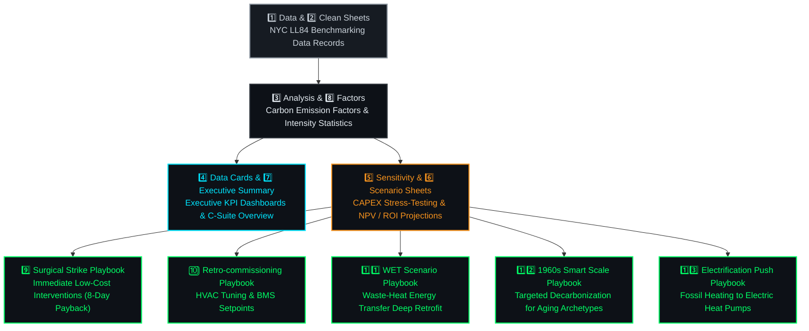

# 📑 Financial Engineering & Domain Reference Models

Welcome to the **Domain & Financial Engineering Layer** of the **Carbon Heist Mitigation Platform**. This directory contains our comprehensive 13-sheet financial & engineering modeling workbook (`Co2 Project.xlsx`) which serves as the domain reference for all statutory penalty calculations, capital expenditure (CAPEX) sensitivity analyses, and decarbonization playbooks.

---

## 📂 Folder Contents

| File Name | Description |
| :--- | :--- |
| **`Co2 Project.xlsx`** | Master 13-sheet engineering & financial reference model for **NYC Local Law 97 (LL97)** compliance modeling and retrofit planning. |

---

## ⚙️ Financial & Engineering 13-Sheet Architecture

---

## 🏛️ Statutory Fine Reference Formula

Across all financial sheets, statutory penalty exposure is evaluated using the official Local Law 97 formula:

> [!IMPORTANT]
> ### **Penalty ($) = Total Emissions (MT CO₂e) × 268**
> Where **$268** is the mandatory fine rate per metric ton of **CO₂e** exceeding statutory thresholds under NYC Local Law 97.

---

## 📊 Summary of Workbook Sheets (13 Sheets)

| # | Sheet Name | Description & Purpose |
| :---: | :--- | :--- |
| **1** | **`Data`** | Raw municipal building energy disclosure records imported from NYC Local Law 84 benchmarking files. |
| **2** | **`Clean`** | Cleaned and filtered data subset retaining compliant properties (**GFA ≥ 50,000 sq. ft.**). |
| **3** | **`Analysis`** | Core analytical sheet computing descriptive statistics, energy intensity distributions, and initial penalty liabilities. |
| **4** | **`Data Cards`** | Executive summary cards summarizing key portfolio metrics, total square footage, and aggregate fines. |
| **5** | **`Sensitivity`** | Sensitivity analysis evaluating how different CAPEX reinvestment rates impact net operating income (NOI) and fine avoidance. |
| **6** | **`Scenario`** | Multi-year scenario projections comparing baseline business-as-usual against decarbonization paths. |
| **7** | **`Executive Summary`** | High-level presentation overview designed for C-suite asset managers and real estate stakeholders. |
| **8** | **`Factors`** | Official municipal carbon emission coefficients (**kg CO₂e / kBtu**) across electricity, natural gas, fuel oil, and steam. |
| **9** | **`Surgical Strike`** | Targeted engineering retrofit playbook focusing on high-impact mechanical and envelope improvements. |
| **10** | **`Retro-commissioning`** | Playbook modeling low-cost Building Management System (BMS) tune-ups and HVAC setpoint optimizations. |
| **11** | **`WET Scenario`** | Whole-Building Energy Transformation (WET) scenario modeling deep energy retrofits. |
| **12** | **`1960s Smart Scale`** | Specialized decarbonization strategy tailored for aging 1960s post-war commercial and residential archetypes. |
| **13** | **`Electrification Push`** | Playbook evaluating the conversion of fossil-based heating systems to electric heat pumps. |
