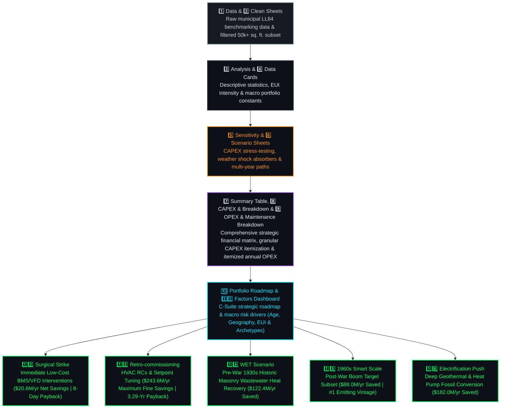

# 📑 Financial Engineering & Domain Reference Models

&nbsp;

---

The **Financial Engineering & Domain Reference Layer (`Excel Project/`)** serves as the quantitative economic core of the **Carbon Heist Mitigation Platform**. Anchored by our comprehensive **16-sheet itemized financial and thermodynamic modeling workbook (`Co2 Project.xlsx`)**, this domain suite establishes the absolute ground-truth reference for all statutory penalty assessments (`Total Emissions × 268`), capital expenditure (**CAPEX**) amortization schedules, net operating income (**NOI**) impact projections, and the self-funding **5 Strategic Decarbonization Playbooks**.

---

## 📂 Folder Contents

| File Name | Description |
| :--- | :--- |
| **`Co2 Project.xlsx`** | Master **16-sheet engineering, itemized financial breakdown, and executive visualization reference workbook** for **NYC Local Law 97 (LL97)** compliance modeling, risk profiling, and retrofit planning across `11,638` properties. |

---

## ⚙️ Financial & Engineering 16-Sheet Architecture

---

## 🏛️ Statutory Fine Reference Formula

Across all financial sheets, statutory penalty exposure is evaluated using the official Local Law 97 formula:

> [!IMPORTANT]
> ### **Penalty ($) = Total Emissions (MT CO₂e) × 268**
> Where **$268** is the mandatory Local Law 97 statutory fine rate evaluated per metric ton of total greenhouse gas emissions across our analyzed portfolio of **11,638** buildings.

---

## 📊 Detailed Structure of Workbook Sheets (16 Sheets)

Our master workbook (`Co2 Project.xlsx`) is logically structured into three distinct functional layers: **Core Data & Baseline Analytics**, **Comprehensive Financial Breakdowns & Executive Summaries**, and **Decarbonization Playbook Scenarios**:

### 📈 I. Core Data & Baseline Analytics (Sheets 1–6)
| # | Sheet Name | Description & Analytical Purpose |
| :---: | :--- | :--- |
| **1** | **`Data`** | Raw municipal building energy disclosure records imported from official NYC Local Law 84 benchmarking files across `21,000+` property records. |
| **2** | **`Clean`** | Filtered and validated data subset retaining compliant properties (**Gross Floor Area ≥ 50,000 sq. ft.**) totaling `11,638` analyzed portfolio assets. |
| **3** | **`Analysis`** | Core analytical sheet computing descriptive statistics, energy intensity (`Site EUI`) distributions, top offender rankings, and baseline unmitigated penalty liabilities (`$2.83 Billion`). |
| **4** | **`Data Cards`** | Executive summary cards defining core portfolio constants, total square footage (`2.06 Billion sq. ft.`), `$268/MT` penalty rate, and weather shock absorber ranges (`+5% to +15%`). |
| **5** | **`Sensitivity`** | Sensitivity stress-testing matrix evaluating how different CAPEX reinvestment rates and weather shock absorbers impact Net Operating Income (`NOI`) and fine avoidance ($/sq. ft.). |
| **6** | **`Scenario`** | Multi-year scenario model comparing baseline business-as-usual unmitigated trajectories against phased decarbonization paths across construction decades (`1930s`, `1950s`, `1970s`). |

---

### 👑 II. Comprehensive Financial Breakdowns & Executive Portals (Sheets 7–11)
| # | Sheet Name | Description & Financial Architecture | Key Visualizations & Features |
| :---: | :--- | :--- | :--- |
| **7** | **`Summary Table`** | **Master Strategic Executive Matrix:** Consolidated portfolio summary detailing unmitigated fine exposure (`$2,830.68M`), total 5-Playbook capital investment (`$4,976.80M`), recurring annual savings (`$656.63M/yr`), and blended capital payback (`7.58 Years`). | Master C-Suite 5-Phase Playbook matrix and macroeconomic cascade table. |
| **8** | **`CAPEX & Breakdown`** | **Granular Itemization of Capital Expenditure:** Detailed engineering and unit-cost breakdown (`$/ft²`, `$/building`) across equipment, labor, mechanical sub-systems, and 50% government PPP/grant subsidies for all 5 playbooks. | Itemized cost allocation rates (`Level 2 Audits: $15K/bldg`, `BMS Optimization: $12.5K/bldg`, `Steam Traps: $12.5K/bldg`). |
| **9** | **`OPEX & Maintenance Breakdown`** | **Granular Operating Expenditure & Maintenance Schedules:** Comprehensive breakdown of recurring annual maintenance costs, operational labor overhead, sensor replacements, and ongoing measurement & verification (`M&V`) expenses. | Itemized OPEX offsets and annual net cash flow calculations verifying long-term asset profitability. |
| **10** | **`Portfolio Roadmap`** | **Strategic Multi-Year Portfolio Roadmap:** Executive C-Suite presentation portal outlining the phased 6-year execution trajectory, cumulative fine elimination milestones, and portfolio transformation pathways from unmitigated risk (`$2.83B`) to residual compliance. | High-level strategic roadmap cards and executive presentation views (`THE CARBON HEIST` - 11,638 Properties across NYC). |
| **11** | **`Factors`** | **Forensic Carbon Drivers Dashboard:** Consolidated visual portal analyzing macro-level risk drivers across Age (`Decade`), Geography (`Borough`), Efficiency (`ENERGY STAR`), and Property Archetypes. | 1. **`Building Vintage Analysis: Total GHG Emissions vs. Penalty Intensity ($/ft²)`** 2. **`NYC Borough Carbon Emissions Distribution (MT CO₂e / Year)`** 3. **`Carbon Concentration by ENERGY STAR Bracket (1–100)`** 4. **`Carbon Emissions by Property Archetype (MT CO₂e / Year)`** |

---

### 🚀 III. Decarbonization Playbook Scenarios (Sheets 12–16)
Each dedicated scenario tab models one of the 5 engineering playbooks and features custom KPI cards (`Penalty Risk Per Year`, `Total Project CAPEX`, `Fine Savings Per Year`), architectural/mechanical illustrations, and **Financial Bridge / Waterfall Charts** (`Before vs. After Statutory Penalty Exposure`):

| # | Sheet Name | Target Subset & Playbook Strategy | Financial Impact & Payback | Bridge Chart Title (`Before vs. After`) |
| :---: | :--- | :--- | :--- | :--- |
| **12** | **`Surgical Strike`** | **Playbook 01 (`Immediate O&M Interventions`):** Low-cost BMS sensors, Variable Frequency Drives (VFDs), and Level 2 audit setpoint tuning for top 10 worst offenders. | **`$20.6M/yr Net Savings`** `$500K CAPEX` **8-Day Payback (`0.02 Yr`)** | **`Surgical Strike Penalty Reduction Waterfall ($20.6M/yr Saved)`** `$51.5M Exposure → $30.9M Residual Penalty` |
| **13** | **`Retro-commissioning`** | **Playbook 02 (`HVAC & BMS Automation`):** Whole-building HVAC retro-commissioning, automated Fault Detection & Diagnostics (FDD), and VAV box balancing at `$1.50/ft²`. | **`$243.6M/yr Maximum Savings`** `$802.2M CAPEX` **3.29-Year Payback** | **`Retro-commissioning Penalty Reduction Bridge ($243.6M/yr Saved)`** `$974.5M Exposure → $730.8M Residual Penalty` |
| **14** | **`WET Scenario`** | **Playbook 04 (`Pre-War 1930s Historic Masonry`):** Waste-heat Energy Transfer (`WET`) wastewater heat recovery systems extracting thermal energy from hot graywater without disrupting architectural facades. | **`$122.4M/yr Net Savings`** `$1.50B Net CAPEX` **12.25-Year Payback** | **`WET Systems Penalty Reduction Bridge ($122.4M/yr Saved)`** `$306.0M Exposure → $183.6M Residual Penalty` |
| **15** | **`1960s Smart Scale`** | **Playbook 03 (`Post-War Boom Archetypes`):** Targeted smart automation, district loop scaling, and envelope weatherization for NYC's #1 single largest emitting construction decade (`1960s`). | **`$88.0M/yr Net Savings`** `$785.2M CAPEX` **8.92-Year Payback** | **`1960s Smart Scale Penalty Bridge ($88.0M/yr Saved)`** `$440.2M Exposure → $352.1M Residual Penalty` |
| **16** | **`Electrification Push`** | **Playbook 05 (`Deep Geothermal & Heat Pumps`):** Replacement of fossil fuel heating boilers with high-efficiency air-source and water-source electric heat pump networks. | **`$182.0M/yr Net Savings`** `$1.89B CAPEX` **10.38-Year Payback** | **`Electrification Push Penalty Reduction Bridge ($182.0M/yr Saved)`** |

---

## 🔗 Explore Other Core Layers of the Project Suite

| Layer | Directory / Deliverable | Strategic Role & Highlights | Documentation Link |
| :---: | :--- | :--- | :---: |
| 📊 **Power BI Portal** | **`PowerBI/NYC_Carbon_Heist_Mitigation_PowerBI_Dashboard.pbix`** | 3-Page Executive C-Suite BI Portal (`Factors` ➔ `Asset Granularity` ➔ `Decarbonization Waterfall`) with custom DAX & `$640.9M` fine savings. | [📖 Power BI Docs](../PowerBI/README.md) |
| 📈 **Tableau BI Portal** | **`Tableau/NYC_Carbon_Heist_Mitigation_Tableau_Dashboard.twbx`** | 3-Page Executive C-Suite BI Portal with macro choropleth maps, fine liability breakdowns (`$2.83B`), and mobile C-Suite QR bridging. | [📖 Tableau Docs](../Tableau/README.md) |
| 🌐 **Live Web Application** | **`application/app.py`** | 5-Tab Streamlit & Plotly interactive dashboard powered by dual-engine AI (`Google Gemini 2.5 + Local Engine`). | [📖 Streamlit Docs](../application/README.md) |
| 🤖 **Predictive AI Engine** | **`models/ll97_model.joblib`** | Random Forest Regressor (`R² = 81.65%`) predicting statutory fine liabilities across 11,638 properties. | [📖 ML Docs](../models/README.md) |
| 🗄️ **Relational Database** | **`database/`** | Normalized 3NF SQL schemas (`MySQL & MSSQL`) and Chen ER diagram enforcing data integrity. | [📖 Database Docs](../database/README.md) |
| 📚 **Academic Suite** | **`Project Documentations/`** | Official 6-part academic deliverables (`Doc 01 - Doc 06`) and comprehensive Word report (`.docx`). | [📖 Academic Suite](../Project%20Documentations/README.md) |

---

&nbsp;

