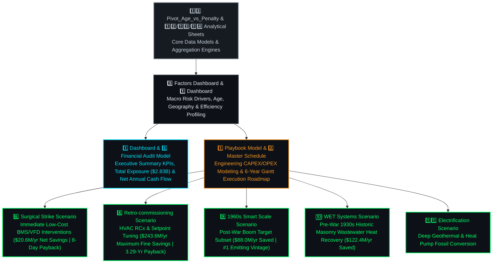

# 📑 Financial Engineering & Domain Reference Models

Welcome to the **Domain & Financial Engineering Layer** of the **Carbon Heist Mitigation Platform**. This directory contains our comprehensive **14-sheet financial, engineering, and C-Suite visualization workbook (`Co2 Project.xlsx`)**, which serves as the master reference for all Local Law 97 statutory penalty calculations, capital expenditure (CAPEX) sensitivity analyses, interactive bridge charts (`Waterfall Charts`), and the 5 Decarbonization Playbooks.

---

## 📂 Folder Contents

| File Name | Description |
| :--- | :--- |
| **`Co2 Project.xlsx`** | Master **14-sheet engineering, financial, and executive visualization reference workbook** for **NYC Local Law 97 (LL97)** compliance modeling, risk profiling, and retrofit planning across `11,639` properties. |

---

## ⚙️ Financial & Engineering 14-Sheet Architecture

---

## 🏛️ Statutory Fine Reference Formula

Across all financial sheets, statutory penalty exposure is evaluated using the official Local Law 97 formula:

> [!IMPORTANT]
> ### **Penalty ($) = Total Emissions (MT CO₂e) × 268**
> Where **$268** is the mandatory fine rate per metric ton of **CO₂e** exceeding statutory thresholds under NYC Local Law 97 across our analyzed portfolio of `11,639` buildings.

---

## 📊 Summary of Workbook Sheets (14 Sheets)

Our master workbook (`Co2 Project.xlsx`) is structured into **Executive Presentation Portals**, **Decarbonization Scenario Dashboards (with Bridge/Waterfall Charts)**, and **Core Analytical Engine Sheets**:

### 👑 I. Executive Presentation Portals & Macro Profiling
| # | Sheet Name | Description & Purpose | Key Visualizations & Titles |
| :---: | :--- | :--- | :--- |
| **1** | **`Dashboard`** | The primary C-Suite Executive Portal summarizing portfolio scale, total baseline liability (`$2,830.3 Million`), and high-level strategy KPIs. | **`THE CARBON HEIST: 11,639 Properties across NYC`** |
| **2** | **`Factors`** | Consolidated executive profiling & risk drivers dashboard presenting the macro-level drivers of statutory carbon liability across Age (`Decade`), Geography (`Borough`), and Efficiency (`ENERGY STAR`). | 1. **`Building Vintage Analysis: Total GHG Emissions vs. Penalty Intensity ($/ft²)`** 2. **`NYC Borough Carbon Emissions Distribution (MT CO₂e / Year)`** 3. **`Carbon Concentration by ENERGY STAR Bracket (1–100)`** 4. **`Carbon Emissions by Property Archetype (MT CO₂e / Year)`** |
| **3** | **`Playbook Model`** | Master engineering strategy & financial calculation table detailing initial CAPEX, annual OPEX, gross annual savings, net annual cash flows, and payback periods across all 5 Decarbonization Playbooks. | Comprehensive itemized 5-Phase Playbook matrix. |
| **4** | **`Master Schedule`** | 6-year execution roadmap, project milestones, dependency mapping, and Gantt tracking. | Phased execution timeline from Phase 1 (`Surgical Strike`) to Phase 5 (`Electrification Push`). |
| **5** | **`Financial Audit Model`** | Comprehensive net cash flow audit, cumulative NPV/ROI projections, and Local Law 97 statutory fine rate schedules ($268/MT). | Itemized OPEX and Net Annual Cash Flow tables verifying our `$656.6M/yr` total net fine elimination. |

---

### 📈 II. Decarbonization Playbook Scenarios (Interactive Bridge & Waterfall Charts)
Each dedicated scenario tab features custom KPI cards (`Penalty Risk Per Year`, `Total Project CAPEX`, `Fine Savings Per Year`), architectural engineering illustrations, and **Financial Bridge / Waterfall Charts** (`Before vs. After Statutory Penalty Exposure`):

| # | Sheet Name | Target Subset & Playbook Focus | Financial Impact & Payback | Bridge Chart Title (`Before vs. After`) |
| :---: | :--- | :--- | :--- | :--- |
| **6** | **`Surgical Strike Scenario`** | **Playbook 01 (`Immediate Operations & Maintenance`):** Low-cost BMS sensors, Variable Frequency Drives (VFDs), and Level 2 audit setpoint tuning for top 10 worst offenders. | **`$20.6M/yr Net Savings`** `$500K CAPEX` **8-Day Payback (`0.02 Yr`)** | **`Surgical Strike Penalty Reduction Waterfall ($20.6M/yr Saved)`** `$51.5M Exposure → $30.9M Residual Penalty` |
| **7** | **`Retro-commissioning Scenario`** | **Playbook 02 (`HVAC & Automation`):** Whole-building HVAC retro-commissioning, automated Fault Detection & Diagnostics (FDD), and VAV box balancing at `$1.50/ft²`. | **`$243.6M/yr Maximum Savings`** `$802.2M CAPEX` **3.29-Year Payback** | **`Retro-commissioning Penalty Reduction Bridge ($243.6M/yr Saved)`** `$974.5M Exposure → $730.8M Residual Penalty` |
| **8** | **`1960s Smart Scale Scenario`** | **Playbook 03 (`Post-War Boom Archetypes`):** Targeted smart automation, district loop scaling, and envelope weatherization for NYC's #1 single largest emitting construction decade (`1960s`). | **`$88.0M/yr Net Savings`** `$785.2M CAPEX` **8.92-Year Payback** | **`1960s Smart Scale Penalty Bridge ($88.0M/yr Saved)`** `$440.2M Exposure → $352.1M Residual Penalty` |
| **9** | **`WET Systems Scenario`** | **Playbook 04 (`Pre-War 1930s Historic Masonry`):** Waste-heat Energy Transfer (`WET`) wastewater heat recovery systems extracting thermal energy from hot graywater inside historic properties without disrupting architectural facades. | **`$122.4M/yr Net Savings`** `$1.50B Net CAPEX` **12.25-Year Payback** | **`WET Systems Penalty Reduction Bridge ($122.4M/yr Saved)`** `$306.0M Exposure → $183.6M Residual Penalty` |
| **10** | **`Electrification Scenario`** | **Playbook 05 (`Deep Geothermal & Heat Pumps`):** Replacement of fossil fuel boilers with high-efficiency air-source and water-source heat pump electrification networks. | **`$182.0M/yr Net Savings`** `$2.30B CAPEX` **12.63-Year Payback** | **`Electrification Push Penalty Reduction Bridge ($182.0M/yr Saved)`** |

---

### ⚙️ III. Underlying Analytical Engines & Pivot Models
| # | Sheet Name | Purpose & Calculation Engine |
| :---: | :--- | :--- |
| **11** | **`Pivot_Age_vs_Penalty`** | Analytical pivot table computing total GHG emissions (`MT CO₂e`) and average penalty rate (`$/ft²`) grouped descending by construction decade (`1960s`, `1920s`, `1970s`, `1950s`, `1930s`...). |
| **12** | **`Sheet2`** | Core analytical data model supporting the construction decade (`Age Factor`) calculations and Local Law 97 statutory rate lookups. |
| **13** | **`Sheet3`** | Core analytical data model computing the distribution of property counts (`3,110 properties in 81-100 bracket`) and aggregate emissions (`~2.3M MT CO₂e in 61-80 bracket`) across ENERGY STAR score quantiles. |
| **14** | **`Sheet4`** | Core analytical data model aggregating carbon emissions geographically across the 5 boroughs (`Treemap Engine` - Manhattan `$5.40M MT CO₂e`) and across primary property archetypes (`Horizontal Bar Engine` - Multifamily Housing vs. Office). |

---

&nbsp;

