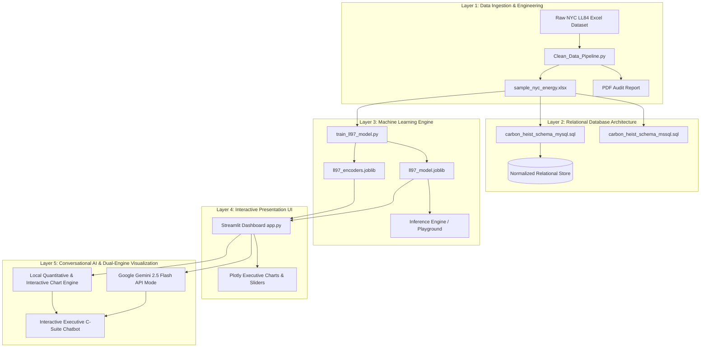
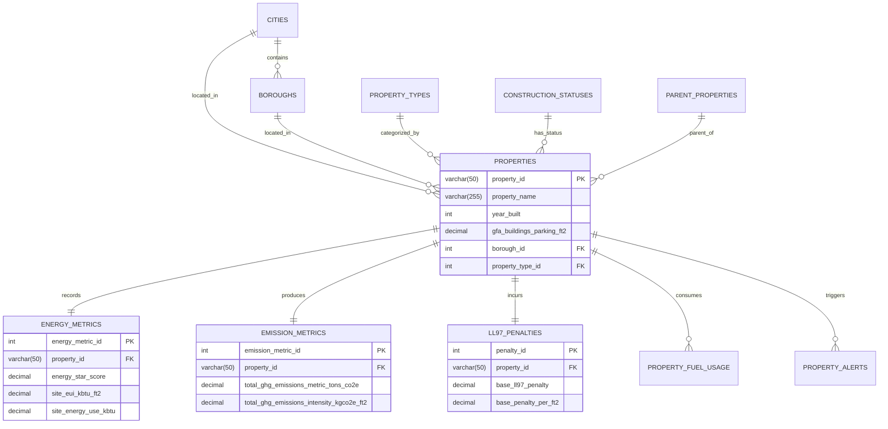
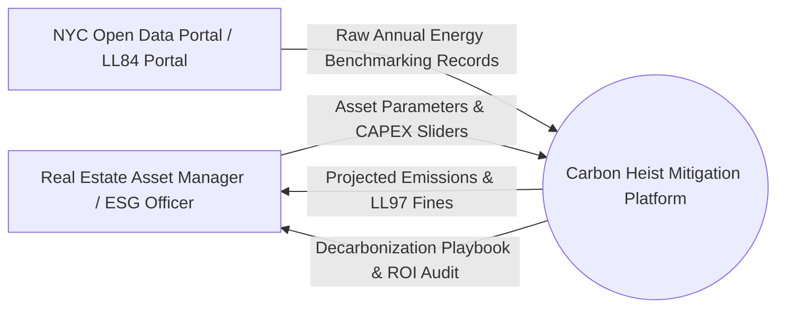
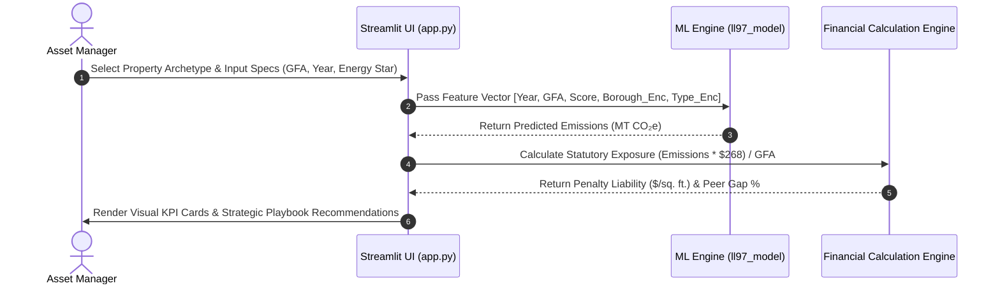
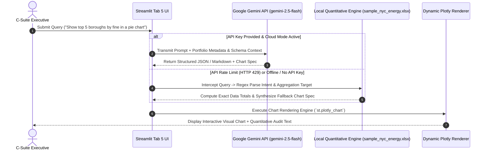
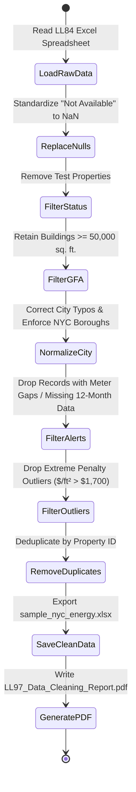

&nbsp;
&nbsp;
&nbsp;

# 📑 DOC 03 — SYSTEM ANALYSIS & DESIGN ARCHITECTURE
### *Carbon Heist Mitigation & NYC Local Law 97 Intelligence Platform*

---

### 🏆 Executive System Architecture Grid

<table width="100%" align="center">
  <tr>
    <td align="center" width="33%">
       
      🏗️ <strong>System Blueprint</strong> 
      <h2 style="color: #00FF66;">5-Layer Stack</h2>
      <em>ETL, DB, ML, Domain, UI</em>
        
    </td>
    <td align="center" width="33%">
       
      🗄️ <strong>Relational Schema</strong> 
      <h2 style="color: #00E5FF;">3NF Normalized</h2>
      <em>MySQL + MSSQL Schemas</em>
        
    </td>
    <td align="center" width="33%">
       
      🤖 <strong>AI Model Pipeline</strong> 
      <h2 style="color: #FF4B4B;">R² = 81.65%</h2>
      <em>RandomForestRegressor</em>
        
    </td>
  </tr>
</table>

---

## 3.1 Problem Statement & Software Architecture

### Problem Statement
Municipal carbon disclosure regulations (Local Law 97) present a complex data and financial challenge: raw annual building disclosure data is often incomplete or noisy, and predicting future carbon penalties under varying building operational parameters is difficult. Without a predictive analytical platform, property managers risk paying excessive carbon fines or overspending on unoptimized capital projects.

---

### Software Architecture (Five-Pillar Layered Architecture)

The system is designed as a modular **Layered Decision-Support Architecture** separating ETL processing, relational persistence, predictive AI modeling, and interactive visualization.

#### Conversational AI & Dual-Engine Architecture (Layer 5)
The interactive presentation layer incorporates an embedded **Dual-Engine Executive AI Co-Pilot & Chatbot**:
1. **Cloud Generative Reasoning Mode (`Google Gemini 2.5 Flash`):** Executes complex strategic queries, scenario reasoning, and on-the-fly custom Plotly chart generation with automatic multi-model fallback (`Gemini 2.5 -> 2.0 -> 1.5 Flash`).
2. **Local Quantitative Charting Engine (`Embedded Fallback`):** Guarantees zero downtime during API rate limits (`HTTP 429`) or offline operations by parsing natural-language queries (`"top 10 buildings"`, `"multifamily housing"`, `"boroughs"`, `"capex"`, `"payback"`) and directly rendering interactive Plotly charts and quantitative text audits from `sample_nyc_energy.xlsx`.

---

## 3.2 Database Design & Data Modeling (ER Diagram)

> [!IMPORTANT]
> ### **3rd Normal Form (3NF) Normalization Standard**
> The relational schema enforces strict 3NF decomposition to eliminate anomaly duplication across geographical lookups (`BOROUGHS`), property classes (`PROPERTY_TYPES`), and annual metering facts (`ENERGY_METRICS`, `LL97_PENALTIES`).

### Entity-Relationship Diagram (ERD)

---

## 3.3 Data Flow & System Behavior

### Context-Level Data Flow Diagram (DFD Level 0)

---

### Sequence Diagram: Real-Time Asset Analysis Workflow (`Tabs 1–4`)

---

### Sequence Diagram: Dual-Engine AI Co-Pilot Workflow (`Tab 5`)

---

### Activity Diagram: Automated ETL Data Cleaning Workflow

---

&nbsp;
&nbsp;
&nbsp;

