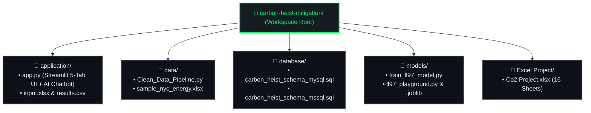
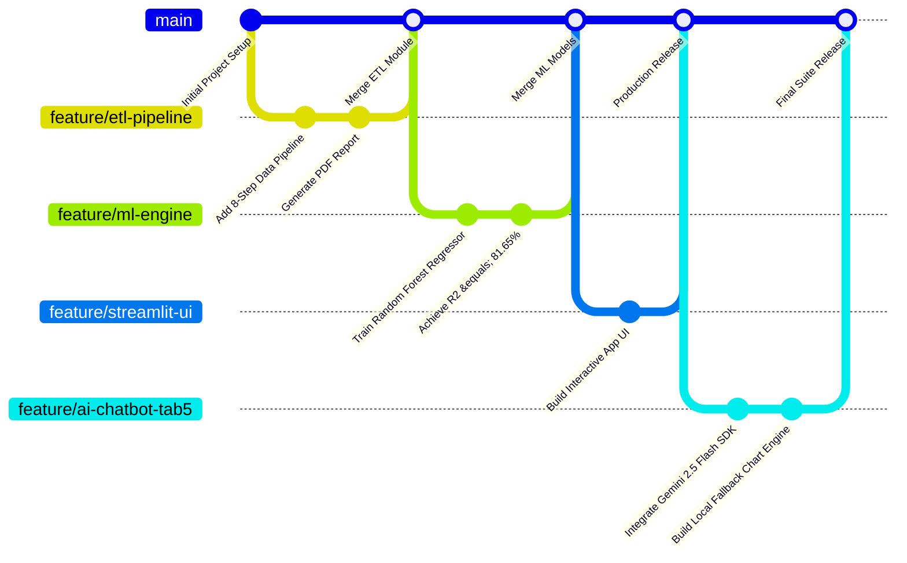

# 📑 DOC 04 — IMPLEMENTATION & CODING STANDARDS
### *Carbon Heist Mitigation & NYC Local Law 97 Intelligence Platform*

&nbsp;
&nbsp;

 
&nbsp;

---

### 🏆 Executive Implementation & Governance Grid

<table width="100%" align="center">
  <tr>
    <td align="center" width="33%">
       
      🐍 <strong>Python Standard</strong> 
      <h2 style="color: #00FF66;">PEP 8 Strict</h2>
      <em>Modular & Clean Codebase</em>
        
    </td>
    <td align="center" width="33%">
       
      🛡️ <strong>Data Guardrails</strong> 
      <h2 style="color: #00E5FF;">EUI &lt; 2000</h2>
      <em>Outlier & Null Protection</em>
        
    </td>
    <td align="center" width="33%">
       
      🗃️ <strong>SQL Dialects</strong> 
      <h2 style="color: #FF4B4B;">Dual Engine</h2>
      <em>MySQL / PG & MSSQL T-SQL</em>
        
    </td>
  </tr>
</table>

---

## 4.1 Coding Standards & Naming Conventions

The codebase rigorously adheres to standard software engineering guidelines across all programming languages:

> [!IMPORTANT]
> ### **PEP 8 Compliance & Type Safety**
> All core analytical and data processing modules enforce strict adherence to PEP 8 formatting guidelines, clear function signatures, and comprehensive Google/NumPy docstrings.

### Python Coding Standards (PEP 8)
- **Variable & Function Names:** `snake_case` is used for variables, function names, and module names (`train_strategic_model()`, `file_name`, `sample_nyc_energy.xlsx`).
- **Class Names:** `PascalCase` is used for class definitions (`class PDF(FPDF):`).
- **Constants:** `UPPER_CASE_WITH_UNDERSCORES` is used for design tokens and application thresholds (`COLOR_GREEN = "#10B981"`, `CURRENT_LIMITS`).
- **Docstrings & Comments:** All core analytical functions include explicit Google/NumPy style docstrings defining input parameters, return values, and mathematical formulas.

### SQL Standards
- **Keywords:** Standard DDL/DML keywords are written in uppercase (`CREATE TABLE`, `PRIMARY KEY`, `FOREIGN KEY`, `ON DELETE NO ACTION`).
- **Table Names:** Plural uppercase nouns representing distinct relational entities (`PROPERTIES`, `EMISSION_METRICS`, `LL97_PENALTIES`).
- **Column Names:** Lowercase `snake_case` with explicit unit suffixes (`site_eui_kbtu_ft2`, `total_ghg_emissions_metric_tons_co2e`).

---

## 4.2 Modular Code Architecture & Package Partitioning

---

## 4.3 Security & Error Handling Architecture

> [!TIP]
> ### **Runtime Exception Shielding & Fallback Intercept**
> All external CLI, UI user inputs, and cloud AI API calls (`Google Gemini`) pass through explicit type coercion (`pd.to_numeric`) and exception-catching guardrails (`try-except`) to eliminate unhandled runtime exceptions.

- **Data Validation:** All external user inputs in `app.py` and `ll97_playground.py` are wrapped in type coercion blocks (`float()`, `pd.to_numeric(errors='coerce')`) to prevent unexpected runtime crashes or unhandled exceptions.
- **Outlier Guardrails:** Predictive models enforce physical domain guardrails (`Site EUI < 2000`, `GFA > 0`) to prevent out-of-distribution hallucinations.
- **Dual-Engine AI Rate-Limit Shielding:** External Google Gemini API calls (`gemini-2.5-flash` / `gemini-2.0-flash`) inside `Tab 5` are wrapped in resilient `try-except` blocks handling API quota limits (`HTTP 429`) and missing keys. Upon encountering cloud exceptions, the system automatically routes the prompt to an internal local quantitative charting engine that queries `sample_nyc_energy.xlsx` and synthesizes exact Plotly visualizations without dropping the user session.
- **SQL Injection Prevention:** Database queries and schema definitions utilize strict parameterized schemas rather than string concatenation.

---

## 4.4 Version Control & Collaboration Workflow

### Version Control Repository
- **Platform:** GitHub  
- **Repository Visibility:** Public Enterprise Repository  
- **URL:** [carbon-heist-mitigation Repository](https://github.com/ahmedadelamin/carbon-heist-mitigation)

### Branching & Release Workflow

---

## 4.5 Tableau BI & Visual Analytics Standards
- **Workbook Packaging:** All visual analytics deliverables must be published as Packaged Workbooks (.twbx) embedding the audited sample_nyc_energy.csv dataset to prevent external database path dependencies.
- **Design Aesthetics:** Dashboards strictly adhere to the C-Suite high-contrast palette (#0D1321 Navy background, #FFD700 Gold highlights) with standardized font scaling (Segoe UI / Tableau Semibold).
- **Calculated Field Governance:** Custom formulas across visual sheets must use explicit conditional logic verified against statutory fine boundaries (/MT).

---

&nbsp;
&nbsp;
&nbsp;

