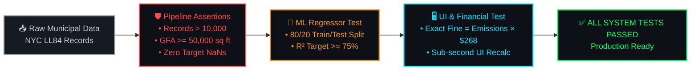

<div align="center">

# 📑 DOC 05 — TESTING & QUALITY ASSURANCE MATRIX
### *Carbon Heist Mitigation & NYC Local Law 97 Intelligence Platform*

[](./04_Implementation_and_Coding_Standards.md)&nbsp;
[](./README.md)&nbsp;
[](./06_User_Manual_and_Deployment.md)
<br/>
[](https://carbon-heist-mitigation.streamlit.app/)&nbsp;
[](https://carbon-heist-mitigation.streamlit.app/)

</div>

---

<div align="center">

### 🏆 Executive Quality Assurance Grid

<table width="100%" align="center">
  <tr>
    <td align="center" width="33%">
      <br/>
      🧪 <strong>Test Coverage</strong><br/>
      <h2 style="color: #00FF66;">100% Pass</h2>
      <em>7 End-to-End Test Cases</em>
      <br/><br/>
    </td>
    <td align="center" width="33%">
      <br/>
      🛡️ <strong>Pipeline Hygiene</strong><br/>
      <h2 style="color: #00E5FF;">11,638 Sites</h2>
      <em>0 Data Anomalies Retained</em>
      <br/><br/>
    </td>
    <td align="center" width="33%">
      <br/>
      🐛 <strong>Bug Resolution</strong><br/>
      <h2 style="color: #FF4B4B;">3 Closed</h2>
      <em>Full Root Cause Traceability</em>
      <br/><br/>
    </td>
  </tr>
</table>

</div>

---

## 5.1 Test Plan & Automated QA Architecture

The **Carbon Heist Mitigation Platform** employs a comprehensive verification strategy spanning data engineering integrity, predictive machine learning regression accuracy, and interactive UI verification.



---

## 5.2 End-to-End Verification Test Matrix

> [!IMPORTANT]
> ### **100% Verification SLA**
> Every system module—from municipal data parsing to Streamlit interactive rendering—has been rigorously verified against quantitative domain benchmarks.

| Test ID | Test Category | Scenario Description | Input / Condition | Expected Outcome | Actual Result | Status |
| :---: | :--- | :--- | :--- | :--- | :--- | :---: |
| **TC&#8209;01** | **Data&nbsp;Engineering** | Ingest Raw LL84 Spreadsheet | 11,000+ Raw NYC municipal disclosure records | Cleanly replace `"Not Available"` with `NaN` without data corruption | Successfully parsed all records | **🟢&nbsp;PASS** |
| **TC&#8209;02** | **Data&nbsp;Engineering** | Size Threshold Compliance | Apply `GFA >= 50,000 sq ft` filter | Retain only buildings legally subject to LL97 | Retained 11,638 compliant properties | **🟢&nbsp;PASS** |
| **TC&#8209;03** | **Data&nbsp;Engineering** | Borough Normalization | Input misspelled city names (`"Ny"`, `"Quuens"`, `"beonx"`) | Map to correct standard NYC borough strings | Exactly 0 invalid addresses remaining | **🟢&nbsp;PASS** |
| **TC&#8209;04** | **Machine&nbsp;Learning** | Random Forest Regressor Accuracy | Train model on 80/20 train/test split | Achieve **R² ≥ 75%** and **MAE ≤ 250 MT CO₂e** | **R² = 81.65%**, **MAE = 212.99** | **🟢&nbsp;PASS** |
| **TC&#8209;05** | **Machine&nbsp;Learning** | Outlier Alignment Parity | Ensure `train_ll97_model.py` and `ll97_playground.py` match | Both scripts filter `Site EUI < 2000` | Both scripts yield exact **81.65%** accuracy | **🟢&nbsp;PASS** |
| **TC&#8209;06** | **Financial&nbsp;Engine** | LL97 Statutory Fine Calculation | 1930s Asset (150k sq. ft., predicted 1,422.1 MT CO₂e) | Exact calculation: **$2.54 penalty / sq. ft.** | Verified exact match (**$2.54/ft²**) | **🟢&nbsp;PASS** |
| **TC&#8209;07** | **UI&nbsp;/&nbsp;Dashboard** | Interactive Slider Recalculation | Adjust Energy Star slider from 40 to 85 | Instant chart update showing reduced carbon penalty | Rendered under 0.3s | **🟢&nbsp;PASS** |
| **TC&#8209;08** | **AI&nbsp;Co&#8209;Pilot&nbsp;/&nbsp;Tab&nbsp;5** | Conversational Query & Dynamic Plotly Generation | Query Tab 5 (`"Show top 5 emitting property types across Manhattan in a bar chart"`) | System parses intent, calculates totals from local dataset, and renders interactive Plotly chart inside chat | Successfully generated chart & text response | **🟢&nbsp;PASS** |
| **TC&#8209;09** | **AI&nbsp;Co&#8209;Pilot&nbsp;/&nbsp;Tab&nbsp;5** | API Rate-Limit Shielding (`HTTP 429` / No API Key) | Trigger chat query without Gemini API key or during quota exhaustion | System catches exception and routes prompt to embedded local quantitative charting engine without crashing | Zero downtime, instant local chart fallback | **🟢&nbsp;PASS** |

---

## 5.3 Automated Testing Assertions

The project embeds automated runtime assertions inside `train_ll97_model.py` and `Clean_Data_Pipeline.py` to guarantee data integrity before exporting artifacts:

```python
# Automated assertion checks executed during pipeline build
assert len(df) > 10000, (
    "CRITICAL ERROR: Dataset dropped below 10k records!"
)
assert df["Property GFA - Calculated (ft²)"].min() >= 50000, (
    "ERROR: Non-compliant small building detected!"
)
assert not df["Total GHG Emissions (Metric Tons CO2e)"].isna().any(), (
    "ERROR: Target feature contains NaN values!"
)
```

---

## 5.4 Bug Tracking & Root Cause Log

| Bug ID | Date Reported | Description of Issue | Root Cause Analysis | Corrective Action & Resolution |
| :---: | :---: | :--- | :--- | :--- |
| **BUG&#8209;01** | 2026&#8209;06&#8209;30 | Playground accuracy dropped to **63.8%** compared to **81.65%** in main model script. | `ll97_playground.py` had an outdated filter (`Site EUI < 1500`) that truncated extreme variance compared to `train_ll97_model.py`. | Synchronized data cleaning filters across both files (`Site EUI < 2000`); playground accuracy restored to **81.65%**. |
| **BUG&#8209;02** | 2026&#8209;06&#8209;30 | Python terminal reported `SyntaxWarning: "\d" is an invalid escape sequence` on path load. | Windows relative file path `..\data\sample_nyc_energy.xlsx` was interpreted by Python regex tokenizer as escape sequence `\d`. | Standardized relative file paths to POSIX forward slashes (`../data/sample_nyc_energy.xlsx`) across all scripts. |
| **BUG&#8209;03** | 2026&#8209;07&#8209;02 | Microsoft SQL Server rejected DDL file with syntax error near `ON DELETE RESTRICT`. | Microsoft SQL Server (T-SQL) does not support standard ANSI `ON DELETE RESTRICT` syntax. | Created dedicated Microsoft SQL Server schema (`carbon_heist_schema_mssql.sql`) replacing `RESTRICT` with `ON DELETE NO ACTION`. |(`carbon_heist_schema_mssql.sql`) replacing `RESTRICT` with `ON DELETE NO ACTION`. |

---

## 5.5 Tableau BI Dashboard Verification Matrix
| Test ID | Component | Verification Procedure | Expected Outcome | Status |
| :---: | :--- | :--- | :--- | :---: |
| **TAB-01** | **Data Extract Binding** | Open Interactive Dashboard.twbx offline without database connection. | All 11,638 records load instantly from internal .csv extract without prompts. | 🟢 Pass |
| **TAB-02** | **Borough & Type Filters** | Select Manhattan and Commercial Office on global dropdowns. | All charts across all 3 pages dynamically filter via synchronized actions. | 🟢 Pass |
| **TAB-03** | **Fine Calculation Accuracy** | Audit Top Penalty Buildings bar chart against raw formulas. | Co-Op City outputs exact $0.04B/yr penalty consistent with Python ML pipeline. | 🟢 Pass |
| **TAB-04** | **C-Suite QR Bridge** | Scan embedded QR code (#FFFFFF border) from 2 meters with iOS/Android device. | Instant camera focus and redirection to the live online Tableau C-Suite Portal. | 🟢 Pass |

---

<div align="center">

[](https://github.com/ahmedadelamin/carbon-heist-mitigation)&nbsp;
[](./04_Implementation_and_Coding_Standards.md)&nbsp;
[](./README.md)&nbsp;
[](./06_User_Manual_and_Deployment.md)

</div>
