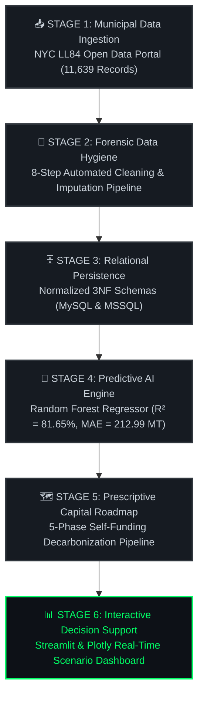

<div align="center">


<br/>

<a href="https://python.org"></a>&nbsp;
<a href="https://scikit-learn.org"></a>&nbsp;
<a href="#-interactive-decision-support-dashboard"></a>&nbsp;
<a href="database/"></a>&nbsp;
<a href="LICENSE"></a>

<br/><br/>

<em>"Compliance is a cost. Executive leadership is an asset."</em><br/>
<strong>— Team X · NYC Local Law 97 Intelligence Platform</strong>

<br/><br/>

---

<div align="center">

### 🏆 Executive Portfolio Performance Dashboard

<table width="100%" align="center">
  <tr>
    <td align="center" width="33%">
      <br/>
      🏢 <strong>Portfolio Scale</strong><br/>
      <h2 style="color: #00FF66;">2.06 Billion Sq. Ft.</h2>
      <em>11,639 NYC Properties</em>
      <br/><br/>
    </td>
    <td align="center" width="33%">
      <br/>
      ⚠️ <strong>Annual LL97 Liability</strong><br/>
      <h2 style="color: #FF4B4B;">$2.88 Billion / yr</h2>
      <em>Statutory Fine ($268 / MT)</em>
      <br/><br/>
    </td>
    <td align="center" width="33%">
      <br/>
      💰 <strong>Net Annual Savings</strong><br/>
      <h2 style="color: #00E5FF;">$702.23 Million</h2>
      <em>Blended Payback: 6.41 Years</em>
      <br/><br/>
    </td>
  </tr>
  <tr>
    <td align="center" width="33%">
      <br/>
      🤖 <strong>Predictive AI Accuracy</strong><br/>
      <h2>R² = 81.65%</h2>
      <em>Random Forest Regressor</em>
      <br/><br/>
    </td>
    <td align="center" width="33%">
      <br/>
      ⚡ <strong>Surgical Phase Payback</strong><br/>
      <h2>8 Days</h2>
      <em>Immediate Cash-Flow Positive</em>
      <br/><br/>
    </td>
    <td align="center" width="33%">
      <br/>
      🗄️ <strong>Database Architecture</strong><br/>
      <h2>3NF Relational</h2>
      <em>MySQL & MSSQL Schemas</em>
      <br/><br/>
    </td>
  </tr>
</table>

</div>

---

## 🏙️ The Mission & Challenge

New York City's **Local Law 97 (LL97)** imposes strict carbon emission caps on buildings exceeding 50,000 sq. ft. Starting in 2024—and escalating dramatically in 2030—properties exceeding statutory thresholds face mandatory annual fines of **$268 per metric ton of CO₂e**.

Across our **2.06 Billion Sq. Ft. real estate portfolio (11,639 validated records)**, unmitigated exposure amounts to **$2.88 Billion annually**—effectively a recurring carbon heist on net operating income (NOI).

We built an end-to-end data engineering, machine learning, and interactive financial decision-support platform to forensic-audit the portfolio, isolate the **"True Culprits,"** and deploy a self-funding 5-phase decarbonization roadmap that transforms a regulatory liability into a high-yield strategic asset.

---

## 📚 Official Project Documentation Suite

All academic and technical deliverables for the **Data Analysis & Engineering Track** are available in the [`docs/`](./docs/) directory:

| Doc ID | Deliverable Title | Core Focus & Highlights | Status | Read Link |
| :---: | :--- | :--- | :---: | :---: |
| **01** | **Project Planning & Management** | Project Proposal, Sequential Gantt Roadmap, Team Roles, Risk Matrix | 🟢 Complete | [📖 Doc 01](./docs/01_Project_Proposal_and_Planning.md) |
| **02** | **Requirements Gathering** | Stakeholder Persona Matrix, User Stories, Functional & NFR Specs | 🟢 Complete | [📖 Doc 02](./docs/02_Requirements_and_Stakeholders.md) |
| **03** | **System Analysis & Design** | 5-Layer Architecture, Normalized ERD, DFD Levels, Sequence Diagrams | 🟢 Complete | [📖 Doc 03](./docs/03_System_Analysis_and_Design.md) |
| **04** | **Implementation & Standards** | PEP 8 Coding Guidelines, Modular Python Packages, Security Audits | 🟢 Complete | [📖 Doc 04](./docs/04_Implementation_and_Coding_Standards.md) |
| **05** | **Testing & Quality Assurance** | End-to-End Verification Matrix, Pipeline Assertions, Bug Tracking | 🟢 Complete | [📖 Doc 05](./docs/05_Testing_and_Quality_Assurance.md) |
| **06** | **User Manual & Deployment** | Step-by-Step Installation Guide, CLI Operations, Troubleshooting | 🟢 Complete | [📖 Doc 06](./docs/06_User_Manual_and_Deployment.md) |
| **DOCX** | **Official Word Documentation** | Comprehensive formatted academic report with executive KPI cards | 🟢 Complete | [📥 Word File](./docs/Carbon_Heist_Mitigation_Documentation.docx) |

---

## 🛠️ End-to-End Data Science & Engineering Architecture



---

## 📂 Complete Repository Tree

```text
carbon-heist-mitigation/
│
├── 📁 docs/                        # Official 6-Part Technical & Academic Documentation Suite
│   ├── 📄 01_Project_Proposal_and_Planning.md
│   ├── 📄 02_Requirements_and_Stakeholders.md
│   ├── 📄 03_System_Analysis_and_Design.md
│   ├── 📄 04_Implementation_and_Coding_Standards.md
│   ├── 📄 05_Testing_and_Quality_Assurance.md
│   ├── 📄 06_User_Manual_and_Deployment.md
│   └── 📄 Carbon_Heist_Mitigation_Documentation.docx
│
├── 📁 Excel Project/               # Domain Reference & Financial Engineering Models
│   ├── 📄 README.md                # Guide to all 13 financial engineering sheets
│   └── 📊 Co2 Project.xlsx         # 13-sheet comprehensive LL97 compliance & retrofit workbook
│
├── 📁 application/                 # Presentation & UI Layer
│   ├── 📄 README.md                # Dashboard setup & usage instructions
│   ├── 🐍 app.py                   # Streamlit & Plotly Interactive Executive Dashboard
│   ├── 📊 input.xlsx               # Clean building benchmarking records for dashboard UI
│   └── 📊 results.csv              # Exported simulation analytics
│
├── 📁 models/                      # AI & Machine Learning Layer (R² = 81.65%)
│   ├── 📄 README.md                # ML architecture & training documentation
│   ├── 🐍 train_ll97_model.py      # Automated model training pipeline
│   ├── 🐍 ll97_playground.py       # Interactive CLI simulation audit tool
│   ├── 💾 ll97_model.joblib        # Serialized Random Forest Regressor
│   └── 💾 ll97_encoders.joblib     # Serialized categorical feature encoders
│
├── 📁 data/                        # Data Engineering & ETL Pipeline
│   ├── 📄 README.md                # 8-step cleaning pipeline overview
│   ├── 🐍 Clean_Data_Pipeline.py   # Automated cleaning & null imputation script
│   ├── 📊 sample_nyc_energy.xlsx   # Validated dataset (11,639 compliant NYC buildings)
│   └── 📄 LL97_Data_Cleaning_Report.pdf # Automated PDF audit report
│
├── 📁 database/                    # Relational Database & Persistence Layer (3NF)
│   ├── 📄 README.md                # Database design & schema guide
│   ├── 📜 carbon_heist_schema_mysql.sql # SQL DDL for MySQL & PostgreSQL
│   ├── 📜 carbon_heist_schema_mssql.sql # Dedicated T-SQL DDL for Microsoft SQL Server
│   ├── 📊 NYC_Energy_CO2_Tables_V2.xlsx # Table data dictionary & relational mappings
│   └── 🗺️ NYC_Energy_Chen_ERD.drawio  # Editable Chen-style ER Diagram
│
├── 📄 requirements.txt             # Python environment dependencies
├── ⚖️ LICENSE                      # MIT License
└── 📄 README.md                    # Project Executive Overview (You are here)
```

---

## 🖥️ Live Forensic Audit Showcase (CLI Engine Output)

Our interactive simulation playground (`models/ll97_playground.py`) provides asset managers and MEP engineers with instant forensic carbon audits and scenario stress-testing:

```text
╔══════════════════════════════════════════════════════════════════════╗
║             NYC LL97 DATA-DRIVEN FORENSIC AUDIT ENGINE             ║
║            Trained on 11,639 Compliant Building Records              ║
╚══════════════════════════════════════════════════════════════════════╝
[*] Training Phase: Loading Random Forest Regressor (R² = 81.65%)...
[✓] Model Ready & Verified.
━━━━━━━━━━━━━━━━━━━━━━━━━━━━━━━━━━━━━━━━━━━━━━━━━━━━━━━━━━━━━━━━━━━━━━
>>> ASSET SPECIFICATION INPUT
  Year Built                     : 1934
  Gross Floor Area (GFA)         : 5,000,000 sq. ft.
  ENERGY STAR Score (1-100)      : 55
  Borough                        : Manhattan
  Primary Property Type          : Commercial Office / Retail
━━━━━━━━━━━━━━━━━━━━━━━━━━━━━━━━━━━━━━━━━━━━━━━━━━━━━━━━━━━━━━━━━━━━━━
>>> STRATEGIC AUDIT VERDICT: COMMERCIAL TOWER — MANHATTAN
  [PREDICTED GHG EMISSIONS]    31,446.0 Metric Tons CO₂e / yr
  [ANNUAL STATUTORY PENALTY]   $8,427,528.00 / yr  ($1.69 / sq. ft.)
  [PORTFOLIO BENCHMARKING]     -30.4% Carbon Intensity vs. Peer Average
  [OPTIMAL RETROFIT VERDICT]   ⚡ HIGH OPPORTUNITY — WET System & BMS Candidate
━━━━━━━━━━━━━━━━━━━━━━━━━━━━━━━━━━━━━━━━━━━━━━━━━━━━━━━━━━━━━━━━━━━━━━
```

<details>
<summary><strong>💡 Strategic Discoveries from Feature Importance Modeling (Click to Expand)</strong></summary>

1. **Gross Floor Area (GFA) & Year Built Dominate Liability:**  
   Physical asset dimensions and structural age are the two strongest predictors of carbon liability—outranking borough geography and primary utility feed type.
2. **1930s Pre-War Skyscrapers Offer Maximum ROI:**  
   Counter-intuitively, pre-war masonry properties hold the highest latent thermal efficiency gains when retrofitted with Waste-heat Energy Transfer (WET) recovery systems.
3. **ENERGY STAR Scores are a Lagging Indicator:**  
   Properties with mid-tier ENERGY STAR scores (50–65) yield disproportionately larger fine avoidance per CAPEX dollar invested compared to high-tier properties.

</details>

---

## 🏛️ Statutory Reference Formulas

Across all academic documentation files, regulatory penalty exposure and capital payback horizons are evaluated using:

<table width="100%" align="center">
  <tr>
    <td width="50%" style="padding: 16px;">
      <h3>⚖️ 1. NYC Local Law 97 Statutory Fine Formula</h3>
      <p>
        <strong>Penalty [in USD] = Total Emissions (MT CO₂e) × 268</strong>
      </p>
      <em>Where <strong>268 USD</strong> is the mandatory fine rate per metric ton exceeding statutory carbon thresholds under NYC Local Law 97.</em>
    </td>
    <td width="50%" style="padding: 16px;">
      <h3>📈 2. CAPEX Retrofit Payback Formula</h3>
      <p>
        <strong>Payback Period (Years) = CAPEX [in USD] ÷ (Annual Utility Savings [in USD] + Avoided LL97 Fines [in USD])</strong>
      </p>
      <em>Measures capital recovery speed combining annual utility cost reductions and statutory penalty avoidance.</em>
    </td>
  </tr>
</table>

---

## 🗺️ The 5-Scenario Self-Funding Decarbonization Pipeline

Our capital deployment follows a strict **self-funding cascade**: rapid-payback early interventions generate immediate operational cash flows that fund deeper structural retrofits without over-leveraging portfolio assets.

| Phase | Strategy&nbsp;Name | Target&nbsp;Archetype | Portfolio&nbsp;Area | CAPEX | Annual&nbsp;Savings | Payback | Strategic Impact |
| :---: | :--- | :--- | :---: | :---: | :---: | :---: | :--- |
| **01** | **🟢&nbsp;Surgical&nbsp;Strike** | High-Intensity Outliers | 20M&nbsp;sq.ft. | **$500K** | **$20.69M** | **8&nbsp;Days** | Immediate cash-flow injection & high fine avoidance |
| **02** | **🔵&nbsp;Smart&nbsp;Scale** | 1960s Commercial / Multi | 400M&nbsp;sq.ft. | **$2.00B** | **$336.01M** | **5.95&nbsp;Yrs** | Large-scale HVAC tune-up & BMS retro-commissioning |
| **03** | **🟡&nbsp;WET&nbsp;System** | 1930s Pre-War Masonry | 20M&nbsp;sq.ft. | **$1.50B** | **$122.89M** | **12.21&nbsp;Yrs** | Waste-heat Energy Transfer (WET) thermal recovery |
| **04** | **🔴&nbsp;Electrification** | 1980s–Present Towers | 100M&nbsp;sq.ft. | **$1.00B** | **$222.64M** | **4.49&nbsp;Yrs** | Fossil heating conversion to electric heat pumps |
| **🏆** | **TOTAL&nbsp;PORTFOLIO** | **Blended Portfolio** | **540M&nbsp;sq.ft.** | **$4.50B** | **$702.23M** | **6.41&nbsp;Yrs** | **Self-Funding Portfolio Transformation** |

---

## 🚀 Quick Start Guide

<table width="100%" align="center">
  <tr>
    <th width="35%" align="left">Execution Stage</th>
    <th width="65%" align="left">Terminal Command & Action</th>
  </tr>
  <tr>
    <td><strong>1. Clone & Setup Environment</strong><br/><em>Install dependencies</em></td>
    <td><code>git clone https://github.com/ahmedadelamin/carbon-heist-mitigation.git</code><br/><code>cd carbon-heist-mitigation && pip install -r requirements.txt</code></td>
  </tr>
  <tr>
    <td><strong>2. Execute Data Pipeline</strong><br/><em>Clean LL84 records & impute nulls</em></td>
    <td><code>python data/Clean_Data_Pipeline.py</code></td>
  </tr>
  <tr>
    <td><strong>3. Train ML Regressor</strong><br/><em>Train Random Forest (R² = 81.65%)</em></td>
    <td><code>python models/train_ll97_model.py</code></td>
  </tr>
  <tr>
    <td><strong>4. Launch UI Dashboard</strong><br/><em>Interactive Streamlit App</em></td>
    <td><code>cd application && streamlit run app.py</code></td>
  </tr>
</table>

> **Live Dashboard Access:** Once launched, the interactive web dashboard automatically opens at `http://localhost:8501`.

---

## 👥 The Heist Crew — Team X

*Five data science and engineering specialists. One mission.*

<table width="100%" align="center">
  <tr>
    <th width="28%" align="left">Operational Role</th>
    <th width="25%" align="left">Team Member</th>
    <th width="47%" align="left">Primary Responsibility & Domain</th>
  </tr>
  <tr>
    <td>🧠&nbsp;<strong>Lead&nbsp;Data&nbsp;Scientist</strong></td>
    <td><strong>Ahmed&nbsp;Adel&nbsp;Amin</strong></td>
    <td>ML Regression Pipeline · Feature Engineering · Automated ETL Wrangle</td>
  </tr>
  <tr>
    <td>⚙️&nbsp;<strong>MEP&nbsp;&&nbsp;Thermal&nbsp;Lead</strong></td>
    <td><strong>Ledia&nbsp;Sobhy</strong></td>
    <td>WET System Thermodynamic Design · Heat Pump Modeling</td>
  </tr>
  <tr>
    <td>📋&nbsp;<strong>Regulatory&nbsp;Specialist</strong></td>
    <td><strong>Huda&nbsp;Amr</strong></td>
    <td>NYC Local Law 97 Audit · Portfolio Compliance Strategy</td>
  </tr>
  <tr>
    <td>💹&nbsp;<strong>Financial&nbsp;Strategist</strong></td>
    <td><strong>Hagar&nbsp;Hussein</strong></td>
    <td>CAPEX Payback Modeling · Sensitivity Analysis · Cash Flow Cascade</td>
  </tr>
  <tr>
    <td>🔍&nbsp;<strong>Analytics&nbsp;Specialist</strong></td>
    <td><strong>Abeer&nbsp;Adel</strong></td>
    <td>Peer Benchmarking · KPI Visualizations · Reporting Suite</td>
  </tr>
</table>

---

<div align="center">


<strong>Turning a $2.88B Regulatory Liability into a High-Yield Strategic Asset</strong><br/>
<em>Team X · NYC LL97 Decarbonization Intelligence Platform · 2026</em>

<br/><br/>

<a href="https://github.com/ahmedadelamin/carbon-heist-mitigation">
  
</a>

</div>
