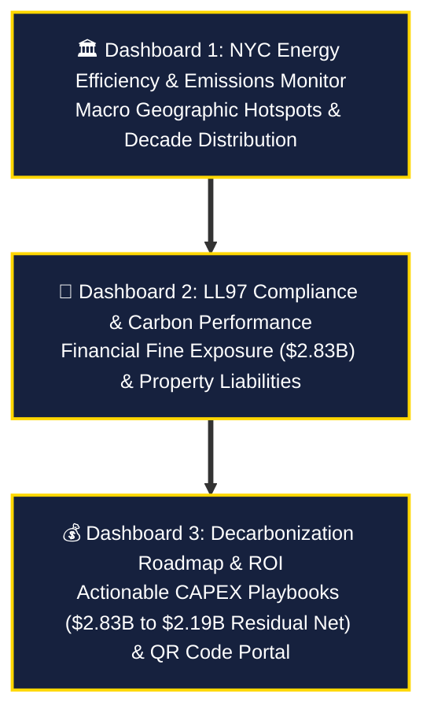

<a id="top"></a>
<div align="center">


<br/>

<a href="../Tableau/Interactive%20Dashboard.twbx"></a>&nbsp;
<a href="https://www.tableau.com/products/desktop"></a>&nbsp;
<a href="../data/sample_nyc_energy.xlsx"></a>&nbsp;
<a href="https://carbon-heist-mitigation.streamlit.app/"></a>

<br/><br/>

<em>"Visual storytelling turns raw municipal data into immediate C-Suite strategic action."</em><br/>
<strong>— Team X · Visual Intelligence & Analytics Suite</strong>

<br/><br/>
</div>

---

## 👑 Executive Overview

The **Tableau Executive Business Intelligence Portal (`Interactive Dashboard.twbx`)** serves as the high-impact visual command center for assessing New York City Local Law 97 (LL97) compliance and financial exposure across our entire audited portfolio of **11,638 commercial and residential properties**. 

Designed specifically for C-Suite executives, asset managers, and municipal policymakers, this packaged workbook (`.twbx`) combines **deep forensic data auditing** with an ultra-premium **C-Suite High-Contrast Navy & Golden (`#0D1321` / `#FFD700`) visual aesthetic**, bridging macro geographical trends directly to building-level statutory fine liabilities.

---

## 📊 The 3 Interconnected C-Suite Dashboards

The workbook is structured into **three progressive, interactive pages** that guide decision-makers from macro-level identification to actionable engineering execution:



### 1️⃣ `NYC Energy Efficiency & Emissions Monitor` (Macro Intelligence)
- **Primary Objective:** Establish the macro footprint of NYC's greenhouse gas emissions across the five boroughs (`10.56M Metric Tons CO₂e`).
- **Core Visualizations:**
  - **Emissions by Borough (Bar Chart):** Highlights Manhattan (`5.40M MT`) and Brooklyn (`1.75M MT`) as the primary emission drivers, followed by Bronx (`1.54M MT`) and Queens (`1.43M MT`).
  - **Geographic Distribution Map:** Spatial bubble/polygon choropleth mapping carbon intensity across NYC zip codes and boroughs.
  - **Decade Built Distribution (Histogram):** Reveals that pre-1970s masonry structures account for over 65% of total baseline emissions.
  - **Emissions vs. Property Area (Scatter Plot):** Correlates Gross Floor Area (`GFA`) against total carbon output to isolate outlier mega-towers.
- **KPI Command Bar:** `Total GHG Emissions (10.56M)` | `GHG Intensity (4.937)` | `Avoided Emissions via Green Power (28,940 MT)`.

---

### 2️⃣ `LL97 Compliance & Carbon Performance` (Financial Shock & Liabilities)
- **Primary Objective:** Quantify the immediate financial exposure and penalties facing non-compliant properties (`$2.83 Billion` projected liabilities).
- **Core Visualizations:**
  - **Compliance Rate Banner:** Vertical stacked progress bar showing compliance severity broken down by borough (`7,309 penalized properties`).
  - **Top Penalty Buildings (Horizontal Bar):** Isolates the highest individual fine offenders across the city (e.g., *Co-Op City* at `$0.04B/yr`, *Pratt S.I. Campus* at `$0.03B/yr`).
  - **Penalties by Property Type:** Proves that **Multifamily Housing (`$1.20B+`)** and **Commercial Offices (`$0.40B+`)** hold 80% of total portfolio fine exposure.
- **KPI Command Bar:** `Avg Energy Star (62.06)` | `Source EUI (126.7 kBtu/ft²)` | `Total Carbon Footprint (10.56M)` | `Total Buildings (11,638)` | `Projected Carbon Penalties (2.83B$)`.

---

### 3️⃣ `Decarbonization Roadmap` (Actionable Engineering Solutions)
- **Primary Objective:** Provide a clean, executive infographic roadmap outlining the self-funding engineering cascade to eliminate statutory fines and achieve carbon neutrality.
- **Core Infographic & Action Panels:**
  - **LL97 Mitigation Roadmap (Waterfall Chart):** Sequential 6-playbook engineering cascade tracing exposure from `1. Baseline Liability ($2,830M)` through `2. Surgical Strike (-$21M)`, `3. Retro-commissioning (-$240M)`, `4. 1960s Smart Scale (-$85M)`, `5. 1930s WET Systems (-$118M)`, and `6. Electrification Push (-$177M)` down to `Residual Net Liability ($2,189M)`.
  - **Strategic Solutions Breakdown:** Detailed prescriptive guidance on `1. Energy Efficiency` (modern low-consumption lighting & HVAC systems), `2. Building Insulation` (high-performance windows & envelope sealing), and `3. Renewable Energy` (solar installations & green energy credits).
  - **📱 Live C-Suite QR Code Portal:** Embedded mobile-scannable QR code formatted inside a crisp white border (`#FFFFFF`) with call-to-action text (`Scan to Explore the Live Interactive C-Suite Portal`), allowing executives to launch the interactive Streamlit AI Co-Pilot directly from their smartphones during boardroom presentations.

---

## 🛠️ Core Calculated Fields & Formulas

The workbook embeds several custom calculated fields designed to enforce strict regulatory logic and financial modeling:

| Calculated Field Name | Tableau Formula / Logic | Strategic Business Purpose |
| :--- | :--- | :--- |
| **`LL97 Risk Category`** | `IF [Base LL97 Penalty] = 0 THEN "✅ Compliant"`<br/>`ELSEIF [Base LL97 Penalty] <= 50000 THEN "⚠️ Moderate Risk"`<br/>`ELSEIF [Base LL97 Penalty] <= 250000 THEN "🔶 High Risk"`<br/>`ELSE "🔴 Critical Risk" END` | Classifies properties into 4 actionable tier buckets for prioritized asset management intervention. |
| **`Penalty Savings Potential`** | `IF [Base LL97 Penalty] > 0 THEN [Base LL97 Penalty] * 0.45 ELSE 0 END` | Models an immediate 45% fine reduction achievable through Level 2 Energy Audits and basic BMS retrofits. |
| **`Total Records`** | `1` | Quantitative anchor for exact property count aggregations across complex multi-table joins. |

---

## 🎨 Design System & Visual Aesthetics

The dashboard adheres to modern **C-Suite visual excellence guidelines**:

- **Dark Royal Background (`#0D1321` / `#1A1A2E`):** Eliminates screen fatigue, creates deep visual contrast, and evokes an executive, high-end business intelligence atmosphere.
- **Golden & Orange Gradients (`#FFD700` ➔ `#F28E2B`):** Warm, high-impact palettes highlight financial penalties and energy intensity without relying on harsh, generic RGB colors.
- **Floating Custom Iconography:** High-resolution transparent PNG shapes (`CO₂ clouds`, `Speedometer gauges`, `Wind turbines`, `Gold rating stars`, and `Gavel warnings`) anchor every KPI card to improve visual scannability.
- **Interactive Global Filtering:** Synchronized dropdown filters for `Borough` and `Primary Property Type` apply across all sheets (`Apply to Worksheets ➔ All Using This Data Source`), ensuring instant multi-dimensional slicing.

---

## 🚀 How to Open & Explore Locally

### 1. Requirements
- **Tableau Desktop** (Version 2022.3 or newer recommended) OR **Tableau Reader** (Free viewing software).

### 2. Launching the Workbook
1. Navigate to the `Tableau/` directory:
   ```bash
   cd Tableau
   ```
2. Double-click **`Interactive Dashboard.twbx`**. Because it is a Packaged Workbook (`.twbx`), the audited data extract (`sample_nyc_energy.csv`) is bundled directly inside—no external database setup or connection reconfiguration is required.
3. Use the bottom navigation tabs (`NYC Energy Efficiency...`, `LL97 Compliance...`, and `Decarbonization Roadmap`) or the built-in golden navigation arrows (`⬅ ➡`) to cycle through the executive story.

---

<div align="center">


<strong>NYC Local Law 97 Intelligence Platform · Tableau Visual Analytics</strong><br/>
<em>Team X · 2026</em>

<br/><br/>

[](../README.md)&nbsp;
[](https://carbon-heist-mitigation.streamlit.app/)
</div>
