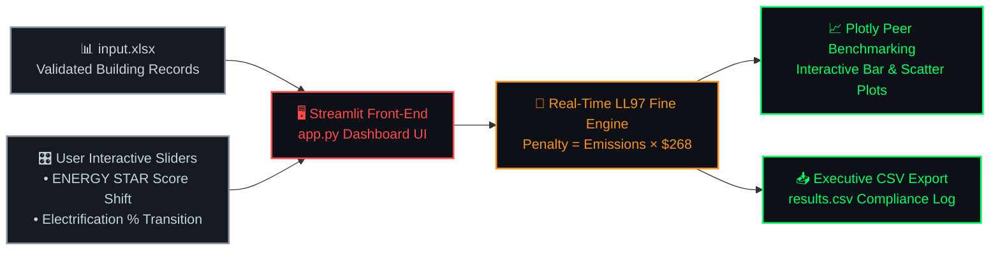

# 🖥️ Application Layer — Interactive Decision Support Dashboard

Welcome to the **Application Layer** of the **Carbon Heist Mitigation Platform**. This folder contains the interactive front-end web dashboard built to help real estate asset managers, sustainability officers, and MEP engineers simulate decarbonization strategies and calculate regulatory penalties under **NYC Local Law 97 (LL97)**.

---

## 📂 Folder Contents

| File Name | Description |
| :--- | :--- |
| **`app.py`** | Full-Stack interactive web dashboard developed with **Streamlit** and **Plotly**. Features dark-mode UI aesthetics, dynamic KPI cards, peer benchmarking charts, and real-time CAPEX simulation sliders. |
| **`input.xlsx`** | Cleaned and validated building benchmarking records utilized by the dashboard for interactive filtering and peer comparison. |
| **`results.csv`** | Exported data table containing calculated carbon liabilities, projected emissions, and financial penalties across different building archetypes. |

---

## ⚙️ Interactive UI & Simulation Flow



---

## 🏛️ Statutory Fine Reference Formula

The interactive dashboard evaluates building carbon liability instantly using the official statutory fine formula:

> [!IMPORTANT]
> ### **Penalty ($) = Total Emissions (MT CO₂e) × 268**
> Where **$268** is the mandatory statutory fine per metric ton of **CO₂e** under NYC Local Law 97.

---

## 🎯 Key Features of the Dashboard

1. **Real-Time Statutory Penalty Calculation:**
   - Evaluates baseline fine liabilities and simulates financial savings immediately upon adjusting parameter inputs.
2. **Interactive Decarbonization Simulation (Sliders):**
   - **Energy Star Efficiency Slider:** Simulate insulation and HVAC optimization improvements.
   - **Electrification Shift Slider:** Model transitioning heating fuel systems from fossil gas to electric heat pumps.
3. **Peer Comparison & Benchmarking:**
   - Visualizes your building's Carbon Intensity (**kg CO₂e / sq. ft.**) against the NYC borough and property type averages.

---

## 🚀 How to Run the Dashboard Locally

Ensure your Python environment has all dependencies installed (`streamlit`, `plotly`, `pandas`, `openpyxl`, `joblib`), then run:

```bash
cd application
streamlit run app.py
```

The dashboard will open automatically in your browser at `http://localhost:8501`.
