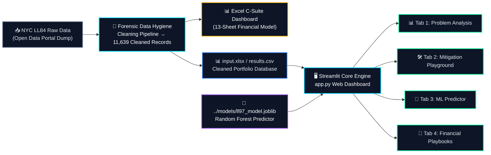

<a id="top"></a>
<div align="center">
  

  <br/>

  <a href="https://carbon-heist-mitigation.streamlit.app/"></a>&nbsp;
  <a href="https://streamlit.io"></a>&nbsp;
  <a href="https://plotly.com"></a>&nbsp;
  <a href="https://scikit-learn.org"></a>&nbsp;
  <a href="#-dual-theme-design-system"></a>&nbsp;
  <a href="../LICENSE"></a>

  <br/><br/>

  <em>"Transforming regulatory carbon liabilities into self-funding engineering strategies."</em><br/>
  <strong>NYC Local Law 97 · Portfolio Asset Management & C-Suite Intelligence Platform</strong>

  <br/><br/>
</div>

---

## 🏢 Executive Overview

The **Application Layer (`application/`)** hosts the full-stack, highly interactive **Carbon Heist Mitigation Dashboard (`app.py`)**. Designed specifically for real estate asset owners, C-Suite executives, sustainability directors, and MEP engineers, this dashboard bridges the gap between **raw building energy benchmarking data**, **statutory fine calculations**, **machine learning compliance inference**, and **capital expenditure (CAPEX) financial engineering**.

> [!TIP]
> ### 🌐 **[Launch the Live C-Suite Interactive Dashboard Online](https://carbon-heist-mitigation.streamlit.app/)**
> Access real-time portfolio emissions analysis, slider-driven mitigation simulations, machine learning risk inference, and 5-playbook CAPEX financial engineering directly in your browser without local setup.



## 📑 Deep-Dive: Analytical Modules (Tabs)

### 1️⃣ Tab 1 — 📊 Problem Analysis & Executive C-Suite Briefing
Provides immediate portfolio-wide situational awareness across filtered NYC properties:
- **Executive KPI Grid**: Displays real-time aggregates for **Total Properties**, **Total GHG Emissions (MT CO₂e)**, **Total Statutory Fine Liability ($B)**, **Avg ENERGY STAR Score**, and **Avoided Emissions**.
- **NYC Borough Analysis (Dual-Axis Chart)**: Visualizes statutory fine exposure ($ bars, left axis) against average carbon intensity (`kgCO₂/ft²` line, right axis) across **Manhattan, Brooklyn, Queens, Bronx, and Staten Island**.
- **Building Age vs. Emission Intensity Scatter**: Incorporates an Ordinary Least Squares (OLS) regression trendline to analyze how infrastructure age correlates with carbon efficiency.
- **Top 10 Carbon Emitters Ledger**: A clean, interactive table highlighting properties with the highest compliance risk, complete with instant search and alert flags.

### 2️⃣ Tab 2 — 🛠️ Mitigation Scenarios & Strategy Playground
Empowers engineers and managers to test decarbonization strategies interactively:
- **Interactive Multi-Slider Simulation**:
  - `S1: Energy Efficiency Shift (0–50%)`: Models envelope insulation, LED retrofits, and EMS controls.
  - `S2: Clean Electrification / PPA Shift (0–80%)`: Models replacing fossil fuels with electric heat pumps or green power purchase agreements.
  - `S3: Deep Envelope Retrofit (0–40%)`: Models complete mechanical and facade overhauls.
- **Interactive Gauge Indicator**: Displays the real-time percentage of total portfolio emissions reduced.
- **Radar Chart Comparison**: Compares holistic physical vs. financial yield across strategies.
- **Return vs. Impact Grouped Bar Chart**: Directly contrasts tons of CO₂e abated versus annual fine savings in dollars.
- **Decarbonization Roadmap**: Interactive timeline illustrating Phase 1 (Audits), Phase 2 (PPAs), and Phase 3 (Deep Retrofits).

### 3️⃣ Tab 3 — 🤖 ML-Powered Property Compliance Predictor
Integrates our trained machine learning models (`models/ll97_model.joblib`) for real-time asset prediction:
- **Custom Property Inference**: Input any building's **Year Built (1800–2026)**, **Gross Floor Area (GFA)**, **ENERGY STAR Score (0–100)**, and **Property Type**.
- **Automated Peer Benchmarking**: Calculates the exact percentage gap between your asset and NYC borough / property archetype averages.
- **Instant Statutory Fine & Compliance Status**: Predicts annual greenhouse gas emissions, statutory penalties ($/year), liability intensity (`$/ft²`), and flags whether the property is **✅ Compliant** or **🚫 Non-Compliant** against NYC Local Law 97 statutory limits.

### 4️⃣ Tab 4 — 💼 Financial Modeling & C-Suite Playbooks
Delivers rigorous capital allocation and financial sensitivity analysis:
- **Grid Shock & Carbon Tax Sensitivity Matrix (Heatmap)**: Models liability intensity (`$/ft²`) under varying statutory rate hikes (**$268, $300, and $350 / MT**) and electrical grid carbon shocks (**+0% to +15%**).
- **5 Strategic Playbooks Payback & CAPEX Comparison**:
  1. *Surgical Strike (Level 2 Audits & Low-Cost Repairs)* — **0.02 yr payback (8 days)**
  2. *Retro-commissioning (RCx & BMS Optimization)* — **3.29 yr payback**
  3. *1960s Smart Scale (LED, VFD Motors & Controls)* — **8.92 yr payback**
  4. *1930s WET Systems (Wastewater Heat Recovery)* — **12.25 yr payback**
  5. *Electrification Push (Fuel Oil #4 to Heat Pumps)* — **10.38 yr payback**
- **Self-Funding Financial Engineering Model**: Demonstrates how ultra-fast payback Phase 1 projects generate immediate operational savings to de-risk and fund deeper capital investments.

---

## 🏛️ Statutory Fine Reference Formula

All calculations inside the dashboard strictly enforce the official NYC statutory penalty structure:

```math
\text{Annual LL97 Penalty} = \text{Total Emissions} \times 268
```

> [!IMPORTANT]
> ### **Statutory Fine = Total Emissions (MT CO₂e) × $268**
> Where **$268 per Metric Ton of CO₂e** is the mandatory fine rate established under NYC Local Law 97.

---

## 📂 Folder Directory & File Descriptions

```text
application/
├── app.py             # Main Streamlit + Plotly full-stack interactive dashboard application
├── input.xlsx         # Cleaned NYC building benchmarking dataset used for filtering & peer analysis
├── results.csv        # Comprehensive compliance ledger containing calculated penalties & intensities
└── README.md          # Technical documentation & dashboard architectural overview
```

| File Name | Role | Description |
| :--- | :--- | :--- |
| **`app.py`** | Application Entry Point | Contains the full UI design tokens, data loaders, sidebar filter logic, ML inference bridges, and Plotly interactive chart generators. |
| **`input.xlsx`** | Benchmarking Database | Processed portfolio dataset with standardized columns (`Property Name`, `Total GHG Emissions`, `Base LL97 Penalty`, `Borough`, `Property Type`, etc.). |
| **`results.csv`** | Compliance Ledger | Pre-computed summary table providing portfolio-wide penalty analytics across building archetypes. |

---

## 🚀 Quickstart & Deployment Guide

### 1️⃣ Prerequisites
Ensure you have Python 3.9+ installed along with the required dependencies:

```bash
pip install streamlit plotly pandas numpy openpyxl joblib scikit-learn
```

### 2️⃣ Running the Dashboard Locally
Navigate to the `application/` directory and launch the Streamlit engine:

```bash
cd application
streamlit run app.py
```

### 3️⃣ Accessing the Interface
- The dashboard will automatically launch in your default browser at **`http://localhost:8501`**.
- **Sidebar & Filters**: The sidebar contains advanced multi-select filters (`City`, `Borough`, `Property Type`, `Building Age`, `ENERGY STAR Score`, and `GHG Emissions`). If collapsed, open it anytime using the toggle arrow (`[ > ]`) at the top left.
- **Theme Switching**: Toggle between **🌙 Dark Mode** and **☀️ Light Mode** directly from the top of the sidebar.

---

<div align="center">

[](https://github.com/ahmedadelamin/carbon-heist-mitigation)&nbsp;
[](../models/README.md)&nbsp;
[](../docs/README.md)

<br/>

**Carbon Heist Mitigation Platform** · Engineered for NYC Local Law 97 Compliance & Strategic Decarbonization

</div>
