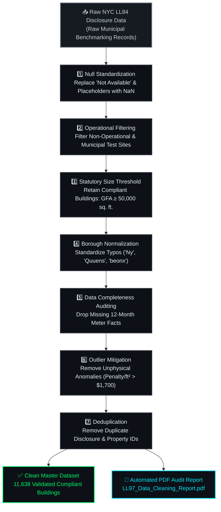

<div align="center">

# 📊 Data Engineering & ETL Pipeline

[](https://carbon-heist-mitigation.streamlit.app/)&nbsp;
[](https://carbon-heist-mitigation.streamlit.app/)

</div>

---

The **Data Engineering & ETL Pipeline Layer (`data/`)** forms the foundational bedrock of the **Carbon Heist Mitigation Platform**. This suite manages the rigorous forensic ingestion, multi-stage hygiene cleaning, outlier normalization, and strict regulatory threshold filtering (`GFA ≥ 50,000 sq. ft.`) of New York City municipal energy disclosure records (**Local Law 84 Benchmarking Data**), transforming raw municipal dumps into an audited master portfolio of **11,638 validated properties** ready for C-Suite financial modeling and AI inference.

---

## 📂 Folder Contents

| File Name | Description |
| :--- | :--- |
| **`Clean_Data_Pipeline.py`** | Automated Python ETL script (`pandas`, `fpdf2`, `openpyxl`). Executes an 8-step cleaning pipeline, removes dirty data and string placeholders, enforces statutory size thresholds (**GFA ≥ 50,000 sq. ft.**), and generates an automated audit PDF report. |
| **`sample_nyc_energy.xlsx`** | The final cleaned and validated master dataset containing **11,638 compliant NYC building records**, ready for Machine Learning training (`models/`), the 16-sheet Excel financial engineering suite (`Excel Project/`), and the 5-Tab Streamlit Dashboard with Dual-Engine AI Chatbot (`application/app.py` Tab 5). |
| **`LL97_Data_Cleaning_Report.pdf`** | Automated PDF audit report generated by `Clean_Data_Pipeline.py`. Details the impact of each cleaning step on record retention and data distribution. |
| **`Raw_Data_Energy_and_Water_Data_Disclosure_...xlsx`** | Raw municipal annual energy disclosure dataset downloaded from the **NYC Open Data Portal** (LL84 Benchmarking Data). |
| **`NYC_BuildingEnergyWaterData_...DataDictionary.xlsx`** | Official municipal data dictionary defining column schemas, variable descriptions, and physical engineering units. |

---

## ⚙️ Automated 8-Step Cleaning Architecture



### Detailed Pipeline Steps:
1. **Null Standardization:** Replaces string placeholders like `"Not Available"` with standard numeric `NaN`.
2. **Operational Filtering:** Filters out non-operational or municipal test properties.
3. **Statutory Size Threshold:** Retains only buildings legally subject to LL97 limits (**GFA ≥ 50,000 sq. ft.**).
4. **Borough Normalization:** Corrects borough string typos (`"Ny"`, `"Quuens"`, `"beonx"`) and maps properties to valid NYC boroughs.
5. **Data Completeness Auditing:** Drops records with critical meter gaps or missing 12-month energy facts.
6. **Outlier Mitigation:** Removes unphysical penalty intensity anomalies (**Penalty / ft² > $1,700**).
7. **Deduplication:** Removes duplicate building disclosure IDs.
8. **Export & Reporting:** Saves `sample_nyc_energy.xlsx` and generates `LL97_Data_Cleaning_Report.pdf`.

---

## 🚀 How to Execute the ETL Pipeline

To rerun the cleaning pipeline from raw data and regenerate the clean dataset and PDF report:

```bash
cd data
python Clean_Data_Pipeline.py
```


---

## 🔗 Explore Other Core Layers of the Project Suite

| Layer | Directory / Deliverable | Strategic Role & Highlights | Documentation Link |
| :---: | :--- | :--- | :---: |
| 📊 **Power BI Portal** | **`PowerBI/NYC_Carbon_Heist_Mitigation_PowerBI_Dashboard.pbix`** | 3-Page Executive C-Suite BI Portal (`Factors` ➔ `Asset Granularity` ➔ `Decarbonization Waterfall`) with custom DAX & `$640.9M` fine savings. | [📖 Power BI Docs](../PowerBI/README.md) |
| 📈 **Tableau BI Portal** | **`Tableau/NYC_Carbon_Heist_Mitigation_Tableau_Dashboard.twbx`** | 3-Page Executive C-Suite BI Portal with macro choropleth maps, fine liability breakdowns (`$2.83B`), and mobile C-Suite QR bridging. | [📖 Tableau Docs](../Tableau/README.md) |
| 🌐 **Live Web Application** | **`application/app.py`** | 5-Tab Streamlit & Plotly interactive dashboard powered by dual-engine AI (`Google Gemini 2.5 + Local Engine`). | [📖 Streamlit Docs](../application/README.md) |
| 📑 **Financial Engineering** | **`Excel Project/Co2 Project.xlsx`** | 16-sheet domain reference workbook featuring comprehensive CAPEX payback modeling and WET system thermodynamics. | [📖 Excel Docs](../Excel%20Project/README.md) |
| 🤖 **Predictive AI Engine** | **`models/ll97_model.joblib`** | Random Forest Regressor (`R² = 81.65%`) predicting statutory fine liabilities across 11,638 properties. | [📖 ML Docs](../models/README.md) |
| 🗄️ **Relational Database** | **`database/`** | Normalized 3NF SQL schemas (`MySQL & MSSQL`) and Chen ER diagram enforcing data integrity. | [📖 Database Docs](../database/README.md) |
| 📚 **Academic Suite** | **`Project Documentations/`** | Official 6-part academic deliverables (`Doc 01 - Doc 06`) and comprehensive Word report (`.docx`). | [📖 Academic Suite](../Project%20Documentations/README.md) |


---

<div align="center">

[](https://github.com/ahmedadelamin/carbon-heist-mitigation)&nbsp;
[](../Project%20Documentations/README.md)

</div>
