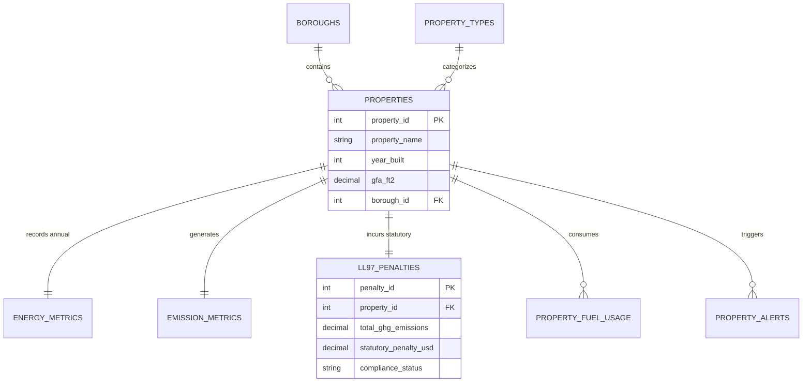

<div align="center">

# 🗄️ Relational Database & Persistence Layer

[](https://carbon-heist-mitigation.streamlit.app/)&nbsp;
[](https://carbon-heist-mitigation.streamlit.app/)

</div>

---

The **Relational Database & Persistence Layer (`database/`)** enforces rigorous data governance, structural integrity, and enterprise persistence across the **Carbon Heist Mitigation Platform**. Designed strictly to Third Normal Form (**3NF**) standards and modeled via professional **Chen Entity-Relationship Diagrams (ERD)**, our relational schema guarantees seamless multi-engine deployment across **MySQL**, **PostgreSQL**, and **Microsoft SQL Server**, eliminating data redundancy across all **11,639** audited municipal records.

---

## 📂 Folder Contents

| File Name | Description |
| :--- | :--- |
| **`carbon_heist_schema_mysql.sql`** | SQL Data Definition Language (DDL) script optimized for **MySQL**, **MariaDB**, and **PostgreSQL**. Implements 3NF normalized tables, foreign key constraints, and indexing. |
| **`carbon_heist_schema_mssql.sql`** | Dedicated T-SQL Data Definition Language script optimized for **Microsoft SQL Server**. Adheres to enterprise T-SQL standards (`ON DELETE NO ACTION`, batch separators `GO`). |
| **`NYC_Energy_Chen_ERD.drawio`** | Complete relational Entity-Relationship Diagram (ERD) designed in Chen / Crow's Foot notation, editable in Draw.io. |
| **`Diagram.png`** | High-resolution exported image of the Entity-Relationship Diagram for quick visual reference. |
| **`NYC_Energy_CO2_Tables_V2.xlsx`** | Data modeling spreadsheet illustrating relational table structures, data types, and sample tuples. |

---

## 🗺️ Relational Schema Entity-Relationship Flow (3NF)



---

## 🏛️ Normalized Schema Architecture (3NF)

The database design splits wide municipal spreadsheets into clean, normalized relational entities that directly mirror our **16-sheet Excel financial engineering model (`Co2 Project.xlsx`)** and power our **5-Tab Streamlit Dashboard (`application/app.py`)**:
- **`CITIES` & `BOROUGHS`:** Standardized geographical lookups enforcing unique address hierarchy across NYC's 5 boroughs.
- **`PROPERTY_TYPES`:** Categorical classifications for commercial, residential, and institutional buildings (`11,639` assets).
- **`PROPERTIES`:** Core entity storing physical building dimensions (`year_built`, `gfa_ft2`).
- **`ENERGY_METRICS` & `EMISSION_METRICS`:** Annual energy consumption facts (`site_eui`, `energy_star_score`) and carbon footprint metrics (`total_ghg_emissions`).
- **`LL97_PENALTIES`:** Statutory fine exposure (`base_ll97_penalty`, `penalty_per_ft2` strictly calculated as $\text{Emissions} \times \$268$).
- **`PROPERTY_FUEL_USAGE`:** Granular breakdown of heating oil, district steam, natural gas, and electricity consumption.
- **`PROPERTY_ALERTS`:** Compliance diagnostics, data integrity flags, and audit triggers.

---

## 🚀 How to Initialize the Database Schema

To deploy the schema to your SQL server instance:

### For MySQL / MariaDB / PostgreSQL:
```bash
mysql -u root -p < carbon_heist_schema_mysql.sql
```

### For Microsoft SQL Server (T-SQL):
```powershell
sqlcmd -S localhost -U sa -P YourPassword -i carbon_heist_schema_mssql.sql
```


---

## 🔗 Explore Other Core Layers of the Project Suite

| Layer | Directory / Deliverable | Strategic Role & Highlights | Documentation Link |
| :---: | :--- | :--- | :---: |
| 📊 **Visual BI Portal** | **`Tableau/Interactive Dashboard.twbx`** | 3-Page Executive C-Suite BI Portal with macro choropleth maps, fine liability breakdowns (`$2.43B`), and mobile C-Suite QR bridging. | [📖 Tableau Docs](../Tableau/README.md) |
| 🌐 **Live Web Application** | **`application/app.py`** | 5-Tab Streamlit & Plotly interactive dashboard powered by dual-engine AI (`Google Gemini 2.5 + Local Engine`). | [📖 Streamlit Docs](../application/README.md) |
| 📑 **Financial Engineering** | **`Excel Project/Co2 Project.xlsx`** | 16-sheet domain reference workbook featuring comprehensive CAPEX payback modeling and WET system thermodynamics. | [📖 Excel Docs](../Excel%20Project/README.md) |
| 🤖 **Predictive AI Engine** | **`models/ll97_model.joblib`** | Random Forest Regressor (`R² = 81.65%`) predicting statutory fine liabilities across 11,639 properties. | [📖 ML Docs](../models/README.md) |
| 🗄️ **Relational Database** | **`database/`** | Normalized 3NF SQL schemas (`MySQL & MSSQL`) and Chen ER diagram enforcing data integrity. | [📖 Database Docs](../database/README.md) |
| 📚 **Academic Suite** | **`Project Documentations/`** | Official 6-part academic deliverables (`Doc 01 - Doc 06`) and comprehensive Word report (`.docx`). | [📖 Academic Suite](../Project%20Documentations/README.md) |


---

<div align="center">

[](https://github.com/ahmedadelamin/carbon-heist-mitigation)&nbsp;
[](../Project%20Documentations/README.md)

</div>
