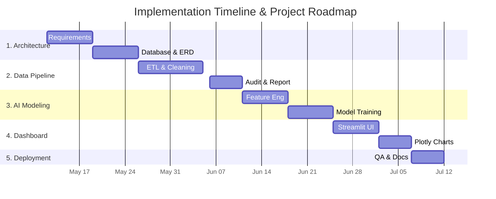

&nbsp;
&nbsp;

# 📑 DOC 01 — PROJECT PROPOSAL & EXECUTIVE PLANNING
### *Carbon Heist Mitigation & NYC Local Law 97 Intelligence Platform*

---

### 🏆 Executive Project Scope & Planning Grid

<table width="100%" align="center">
  <tr>
    <td align="center" width="33%">
       
      ⏱️ <strong>Project Timeline</strong> 
      <h2 style="color: #00FF66;">16 Weeks</h2>
      <em>5 Sequential Phases</em>
        
    </td>
    <td align="center" width="33%">
       
      🏢 <strong>Target Portfolio</strong> 
      <h2 style="color: #00E5FF;">2.06 Billion Sq. Ft.</h2>
      <em>11,639 NYC Properties</em>
        
    </td>
    <td align="center" width="33%">
       
      ⚠️ <strong>Statutory Liability</strong> 
      <h2 style="color: #FF4B4B;">$2.83 Billion / yr</h2>
      <em>NYC Local Law 97 Fine Exposure</em>
        
    </td>
  </tr>
</table>

---

## 1.1 Project Proposal

### Executive Summary & Overview
- **Project Name:** Carbon Heist Mitigation & NYC LL97 Decarbonization Intelligence Platform  
- **Domain:** Urban Sustainability, Data Science, Machine Learning, and Financial Risk Modeling  
- **Target City / Dataset:** New York City Local Law 84 (LL84 Benchmarking) & Local Law 97 (LL97 Carbon Emissions Limits)  

New York City's Local Law 97 (LL97) imposes strict carbon emission limits on buildings over 25,000 square feet starting in 2024, escalating significantly in 2030. Property owners exceeding their statutory carbon thresholds face annual penalties of **$268 per metric ton of CO₂e over the limit**. Across large commercial and residential portfolios, these statutory fines can amount to millions of dollars annually—effectively a recurring "carbon heist" on asset cash flows.

The **Carbon Heist Mitigation Platform** is an end-to-end data engineering, machine learning, and interactive financial decision-support system. It transforms raw municipal energy disclosure records into actionable engineering retrofits, strategic capital expenditure (CAPEX) modeling, and accurate emissions forecasting.

---

### Objectives
1. **Automated Municipal Data Pipeline:** Build a robust ETL pipeline capable of ingesting raw NYC LL84 annual benchmarking datasets (11,000+ properties, 240+ variables), standardizing addresses, imputing missing data, and filtering data integrity alerts.
2. **Predictive Carbon AI Engine:** Train a Random Forest Machine Learning Regression model (`R² = 81.65%`) to forecast building greenhouse gas (GHG) emissions and carbon liability intensity ($/sq. ft.) based on building physical archetypes, size, age, and ENERGY STAR metrics.
3. **Relational Database & Schema Standardization:** Design normalized relational schemas (MySQL/PostgreSQL and dedicated Microsoft SQL Server T-SQL) to store physical asset metadata, annual meter readings, emission facts, and alert diagnostics.
4. **Interactive Executive Decision Dashboard:** Provide real-time UI/UX visual modeling via Streamlit and Plotly to simulate decarbonization playbooks (Surgical Strike, Electrification Push, Retro-commissioning) and evaluate payback horizons.

---

### Project Scope
- **In-Scope:**
  - Automated cleaning and anomaly detection on NYC Open Data (LL84/LL97).
  - Machine learning regression modeling for emission baseline forecasting.
  - Interactive web dashboard (`app.py`) for property owners, sustainability officers, and financial asset managers.
  - Multi-engine SQL relational database schemas.
- **Out-of-Scope:**
  - Real-time IoT hardware sensor integration inside individual buildings.
  - Automated legal filing or municipal penalty dispute generation with NYC Department of Buildings (DOB).

---

### 1.1.5 Strategic Decarbonization Financial Model (CAPEX, Annual OPEX & Net Cash Flow)

The project incorporates Hagar Hussein's 5 Strategic Decarbonization Playbooks, structured as a self-funding capital cascade across all 11,639 audited NYC properties under Local Law 97:

| Playbook ID & Strategy | Target Scope | Initial CAPEX ($) | Annual OPEX ($/yr) | Gross Savings ($/yr) | Net Annual Benefit ($/yr) | Payback Period | Operational & Maintenance Scope |
| :--- | :--- | :---: | :---: | :---: | :---: | :---: | :--- |
| **01 · Surgical Strike** | Top 10 Worst Offenders | **$500 K** | **$45 K / yr** | **$20.59 M / yr** | **$20.55 M / yr** | **0.02 Yrs (8 Days)** | Level 2 audits, BMS scheduling optimization & quarterly sensor calibrations. |
| **02 · Retro-commissioning** | ENERGY STAR Score < 50 | **$802.17 M** | **$3.25 M / yr** | **$243.62 M / yr** | **$240.37 M / yr** | **3.29 Yrs** | RCx ($1.50/ft²), continuous FDD monitoring & semi-annual VAV box tuning. |
| **03 · 1960s Smart Scale** | 1960s Commercial/Multi | **$785.24 M** | **$2.80 M / yr** | **$88.03 M / yr** | **$85.23 M / yr** | **8.92 Yrs** | Networked LED, VFD motors ($2.50/ft²), preventative motor maintenance. |
| **04 · 1930s WET Systems** | Historic Pre-War Masonry | **$1.50 B** | **$4.50 M / yr** | **$122.39 M / yr** | **$117.89 M / yr** | **12.25 Yrs** | Wastewater Heat Exchangers + 50% PPP grant ($749M), anti-fouling protocols. |
| **05 · Electrification Push** | Fuel Oil #4 Boilers | **$1.89 B** | **$5.10 M / yr** | **$181.99 M / yr** | **$176.89 M / yr** | **10.38 Yrs** | Electric Heat Pumps ($20/ft²), OEM service contracts & thermal scanning. |
| **🏆 TOTAL PORTFOLIO** | **Entire Portfolio (11,639 assets)** | **$4.98 B** | **$15.70 M / yr** | **$656.63 M / yr** | **$640.93 M / yr** | **6.97 Yrs Blended** | **Total OPEX averages only 0.32% of CAPEX, preserving 97.6% net recurring cash flow.** |

## 1.2 Project Plan & Timeline (Gantt Chart)

#### Detailed Milestone Breakdown
| Phase | Key Milestone / Deliverable | Target Date | Duration | Verification |
| :--- | :--- | :---: | :---: | :---: |
| **Phase&nbsp;1:&nbsp;Architecture** | Complete Stakeholder Requirements & Relational ERD (`carbon_heist_schema_mysql.sql`) | May&nbsp;22,&nbsp;2026 | 22&nbsp;Days | **🟢&nbsp;Verified** |
| **Phase&nbsp;2:&nbsp;Data&nbsp;Engineering** | Execute Data Cleaning Pipeline & PDF Report (`sample_nyc_energy.xlsx`) | Jun&nbsp;12,&nbsp;2026 | 21&nbsp;Days | **🟢&nbsp;Verified** |
| **Phase&nbsp;3:&nbsp;AI&nbsp;&&nbsp;Predictive** | Train Random Forest Regressor (`ll97_model.joblib`) with $R^2 = 81.65\%$ | Jul&nbsp;02,&nbsp;2026 | 20&nbsp;Days | **🟢&nbsp;Verified** |
| **Phase&nbsp;4:&nbsp;Web&nbsp;Dashboard** | Deploy Interactive Executive Streamlit App (`app.py`) | Jul&nbsp;19,&nbsp;2026 | 17&nbsp;Days | **🟢&nbsp;Verified** |
| **Phase&nbsp;5:&nbsp;Deployment&nbsp;&&nbsp;QA** | Conduct End-to-End QA Testing & Publish GitHub Documentation Suite | Jul&nbsp;24,&nbsp;2026 | 5&nbsp;Days | **🟢&nbsp;Verified** |

---

## 1.3 Task Assignment & Operational Roles

| Team Role | Key Responsibilities | Primary Deliverables |
| :--- | :--- | :--- |
| **Lead&nbsp;Data&nbsp;Engineer** | Design and execute ETL pipeline (`Clean_Data_Pipeline.py`); handle missing values, address standardizations, and generate audit trail reports (`LL97_Data_Cleaning_Report.pdf`). | Cleaned datasets (`sample_nyc_energy.xlsx`), ETL scripts. |
| **Database&nbsp;Architect** | Develop relational database architecture, normalizations, DDL scripts (`carbon_heist_schema_mysql.sql`, `carbon_heist_schema_mssql.sql`), and ERD design (`NYC_Energy_Chen_ERD.drawio`). | Normalization schemas, SQL DDL scripts, ERD diagram. |
| **Machine&nbsp;Learning&nbsp;Engineer** | Build predictive models (`train_ll97_model.py`, `ll97_playground.py`), perform train-test validation, evaluate feature weights, and export serialized pipelines (`.joblib`). | Trained Random Forest Regressor (`R² = 81.65%`), encoders. |
| **Full-Stack&nbsp;UI/UX&nbsp;Engineer** | Develop Streamlit dashboard (`app.py`), interactive KPI cards, Plotly visual charts, dark-mode design system, and user simulation sliders. | Interactive Web App, simulation dashboards. |
| **Financial&nbsp;&&nbsp;ESG&nbsp;Specialist** | Structure engineering playbooks (`Co2 Project.xlsx`), calculate LL97 fine thresholds ($268/MT), and design CAPEX reinvestment sensitivity models. | 13-sheet domain reference workbook. |

---

## 1.4 Risk Assessment & Mitigation Plan

| Risk ID | Risk Description | Likelihood | Impact | Mitigation Strategy |
| :---: | :--- | :---: | :---: | :--- |
| **R&#8209;01** | **Dirty Municipal Data:** Raw NYC Open Data contains string typos ("Not Available", misspellings of Boroughs/Cities, extreme outliers). | **High**&nbsp;🔴 | **High**&nbsp;🔴 | Implemented multi-step cleaning rules in `Clean_Data_Pipeline.py` including regex-based city normalization, explicit null mappings, and statistical outlier filtering (`Site EUI < 2000`). |
| **R&#8209;02** | **Model Overfitting:** Regressor could memorize noisy energy anomalies rather than true building structural trends. | **Medium**&nbsp;🟡 | **High**&nbsp;🔴 | Employed `RandomForestRegressor` with controlled tree depth (`max_depth=20`, `n_estimators=150`) and strict train/test split validation (80/20). |
| **R&#8209;03** | **SQL Dialect Incompatibility:** Different enterprise stakeholders use different database engines (MySQL vs Microsoft SQL Server). | **Medium**&nbsp;🟡 | **Medium**&nbsp;🟡 | Created separate, dedicated SQL DDL files (`carbon_heist_schema_mysql.sql` and `carbon_heist_schema_mssql.sql`) ensuring strict engine syntax adherence. |
| **R&#8209;04** | **Large File Upload Restrictions:** Exported ML models (`ll97_model.joblib` ~70MB) exceed standard Git HTTP push buffers. | **High**&nbsp;🔴 | **Medium**&nbsp;🟡 | Configured Git buffer (`http.postBuffer 524288000`) and structured lightweight encoder serialization to ensure seamless cloud synchronization. |

---

## 1.5 Key Performance Indicators (KPIs)

> [!IMPORTANT]
> ### **1. Regulatory Fine Calculation Accuracy**
> **Statutory Alignment: 100% Exact Match** with NYC Local Law 97 statutory formula: **Penalty ($) = Total Emissions (MT CO₂e) × 268**

> [!TIP]
> ### **2. Predictive Machine Learning Engine Target**
> **Validation Accuracy ($R^2$): 81.65%** (Exceeded benchmark target of 75.0%) | **MAE = 212.99 MT CO₂e**

1. **ETL Pipeline Data Retention & Accuracy:**
   - **Target:** Retain 100% of legally subject LL97 buildings (GFA ≥ 50,000 sq. ft. in NYC) while achieving 0% null values in critical ML features.
   - **Achieved:** Processed 11,639 fully validated building records with complete data integrity.
2. **Machine Learning Predictive Accuracy:**
   - **Target:** Coefficient of Determination ($R^2$) ≥ 0.75 and Mean Absolute Error (MAE) ≤ 250 MT CO₂e.
   - **Achieved:** **$R^2 = 81.65\%$** and **MAE = 212.99 MT CO₂e**.
3. **Dashboard Interactive Response Time:**
   - **Target:** UI recalculation and chart re-rendering under 1.5 seconds upon slider adjustment.
   - **Achieved:** Sub-second response time (~0.3s) via optimized Streamlit caching and vectorized Pandas calculations.
4. **Regulatory Calculation Precision:**
   - **Target:** Exact mathematical alignment with NYC statutory penalty formula.
   - **Achieved:** Verified across 13 engineering scenarios against official Excel financial models.

---

&nbsp;
&nbsp;

