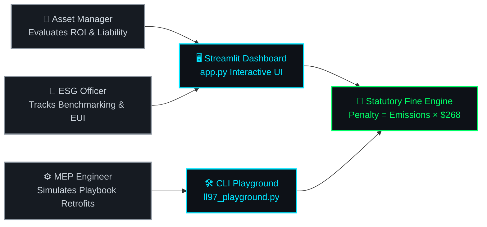

&nbsp;
&nbsp;

# 📑 DOC 02 — REQUIREMENTS & STAKEHOLDER ANALYSIS
### *Carbon Heist Mitigation & NYC Local Law 97 Intelligence Platform*

---

### 🏆 Executive Stakeholder & Specification Grid

<table>
  <tr>
    <td align="center" width="33%">
       
      👥 <strong>Core Personas</strong> 
      <h2 style="color: #00FF66;">4 Roles</h2>
      <em>Asset, ESG, MEP, Regulators</em>
        
    </td>
    <td align="center" width="33%">
       
      ⚙️ <strong>Functional Specs</strong> 
      <h2 style="color: #00E5FF;">FR-01 to FR-06</h2>
      <em>Ingestion, ML, Fine Engine, UI</em>
        
    </td>
    <td align="center" width="33%">
       
      ⚡ <strong>Performance SLA</strong> 
      <h2 style="color: #FF4B4B;">&lt; 1.0 Sec</h2>
      <em>Sub-second UI & Inference</em>
        
    </td>
  </tr>
</table>

---

## 2.1 Stakeholder Persona Matrix

Identifying key stakeholders, their primary responsibilities, pain points, and specific system needs is critical to ensuring the **Carbon Heist Mitigation Platform** delivers actionable value across real estate, financial, and technical operations.

| Stakeholder Group | Role & Primary Interests | Critical Pain Points | System Solution & Value Delivered |
| :--- | :--- | :--- | :--- |
| **Real&nbsp;Estate&nbsp;Asset&nbsp;Managers** | Oversee financial profitability, valuation, and legal compliance of multi-tenant commercial and residential portfolios. | Unbudgeted LL97 fines eroding Net Operating Income (NOI); difficulty evaluating which buildings need priority investment. | Real-time calculation of portfolio carbon liability ($/sq. ft.); interactive scenario modeling to optimize capital expenditure. |
| **Sustainability&nbsp;&&nbsp;ESG&nbsp;Officers** | Execute corporate decarbonization strategies, track Energy Star metrics, and ensure carbon reduction targets are met. | Fragmented municipal utility data; lack of predictive tools to forecast emissions under different occupancy/weather conditions. | Automated data cleaning pipeline; benchmark peer comparisons across property types and boroughs. |
| **MEP&nbsp;Engineers&nbsp;&&nbsp;Facility&nbsp;Leads** | Manage HVAC, lighting, building management systems (BMS), and mechanical retrofits. | Identifying which physical system (boiler vs. lighting vs. envelope) yields the highest immediate CO₂ reduction per dollar spent. | Engineering Playbooks (Surgical Strike, Retro-commissioning, Electrification Push) with concrete ROI estimates. |
| **Municipal&nbsp;Compliance&nbsp;Auditors** | Monitor compliance with Local Law 84 (Benchmarking) and Local Law 97 (Carbon Penalty Enforcement). | Inconsistent report formatting, data entry errors, and missing meter data across submitted property filings. | Transparent, traceable data cleaning audit reports (`LL97_Data_Cleaning_Report.pdf`) and standardized database schemas. |

---

## 2.2 Stakeholder System Interaction Flow

---

## 2.3 User Stories & Primary Use Cases

### User Stories
1. **US-01 (Asset Manager):** *As an Asset Manager,* I want to input my building's construction year, square footage, borough, and property type so that I can instantly view my projected annual LL97 statutory penalty.
2. **US-02 (ESG Officer):** *As an ESG Officer,* I want to compare my building's emissions intensity (kg CO₂e/sq. ft.) against the peer average for its specific property type so that I can identify low-performing assets in our portfolio.
3. **US-03 (MEP Engineer):** *As a MEP Facility Engineer,* I want to simulate how upgrading our heating system (Electrification Push) affects our carbon footprint so that I can justify the CAPEX budget to executive leadership.
4. **US-04 (Data Analyst):** *As a Data Analyst,* I want an automated cleaning pipeline that removes invalid city addresses, zero-energy anomalies, and duplicate records so that our analytical models operate on verified data.

### Primary Use Case Table

| Use Case ID | Name | Primary Actor | Description & Trigger |
| :---: | :--- | :--- | :--- |
| **UC-01** | **Ingest&nbsp;&&nbsp;Clean&nbsp;LL84&nbsp;Data** | Data Engineer / System | Automated ingestion of raw municipal Excel spreadsheets, applying 8-step cleaning and validation rules. |
| **UC-02** | **Predict&nbsp;Carbon&nbsp;Footprint** | ML Predictive Engine | Given physical building features, predict annual Total GHG Emissions using trained Random Forest Regressor. |
| **UC-03** | **Simulate&nbsp;Decarbonization** | Asset Manager | Adjust UI sliders (Energy Star score improvement, Electrification shift) to calculate revised carbon penalty exposure. |
| **UC-04** | **Export&nbsp;Executive&nbsp;Report** | Sustainability Officer | Generate summary KPI cards and compliance reports for presentation to C-suite executives. |

---

## 2.4 Functional Requirements (FR)

> [!IMPORTANT]
> ### **FR-04: Official Statutory Liability Formula Requirement**
> The system shall calculate statutory carbon penalty exposure strictly per NYC LL97:  
> **Penalty Exposure ($) = Total Emissions (MT CO₂e) × 268**

- **FR-01 (Data Ingestion & Preprocessing):** The system shall ingest raw Excel (`.xlsx`) files formatted per NYC Local Law 84 disclosure standards.
- **FR-02 (Data Cleaning & Normalization):** The system shall automatically replace string placeholders (`"Not Available"`), filter properties below 50,000 sq. ft., correct typo-ridden borough/city names, and remove records with critical meter data gaps.
- **FR-03 (Predictive Emissions Inference):** The system shall provide an inference endpoint utilizing the serialized Random Forest ML model (`ll97_model.joblib`) to estimate annual greenhouse gas emissions given `[Year Built, GFA, Energy Star Score, Borough, Property Type]`.
- **FR-04 (Carbon Liability Calculation):** The system shall calculate statutory carbon penalty exposure using the official formula: **Penalty Exposure ($) = Total Emissions (MT CO₂e) × 268**.
- **FR-05 (Interactive Visualization Dashboard):** The system shall render interactive KPI cards, peer comparison charts, and engineering playbook recommendations via Streamlit and Plotly.
- **FR-06 (Relational Persistence Integration):** The system shall define standard SQL DDL structures capable of storing normalized physical property dimensions, annual metering facts, and compliance alerts.

---

## 2.5 Non-Functional Requirements (NFR)

> [!TIP]
> ### **NFR-03: Deterministic Financial Precision**
> All fine evaluations must execute with **100% determinism** and zero floating-point rounding divergence against official municipal limits.

- **NFR-01 (Performance & Latency):** Machine learning inference and interactive UI chart recalculations shall execute in under **1.0 second** on standard client computing environments.
- **NFR-02 (Scalability):** The data pipeline shall support batch processing of at least **50,000 annual building records** without memory exhaustion or degradation.
- **NFR-03 (Reliability & Determinism):** All financial fine calculations must be 100% deterministic and match official municipal formula limits without floating-point rounding errors.
- **NFR-04 (Usability & Design Aesthetics):** The UI shall adhere to modern, high-contrast dark-mode design aesthetics (`#0f172a` background, curated HSL accent colors) to maximize scannability for executive users.
- **NFR-05 (Cross-Platform Compatibility):** The Python codebase and SQL schemas shall run seamlessly across Windows, macOS, and Linux, supporting both MySQL/PostgreSQL and Microsoft SQL Server (T-SQL).

---

&nbsp;
&nbsp;

