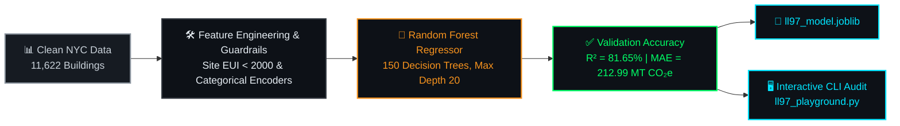

<div align="center">

# 🤖 Artificial Intelligence & Predictive Modeling Layer

[](https://carbon-heist-mitigation.streamlit.app/)&nbsp;
[](https://carbon-heist-mitigation.streamlit.app/)

</div>

---

The **Predictive Artificial Intelligence & Machine Learning Layer (`models/`)** serves as the core quantitative engine of the **Carbon Heist Mitigation Platform**. By leveraging advanced ensemble regression (`Random Forest Regressor` achieving **R² = 81.65%**), this suite empowers real estate asset owners, sustainability directors, and C-Suite executives to forecast building greenhouse gas (GHG) emissions with mathematical precision, quantify statutory fine liabilities under **NYC Local Law 97**, and simulate proactive capital mitigation scenarios well before regulatory enforcement deadlines.

---

## 📂 Folder Contents

| File Name | Description |
| :--- | :--- |
| **`train_ll97_model.py`** | Automated Python model training pipeline (`scikit-learn`, `joblib`). Loads cleaned records, applies outlier guardrails (**Site EUI < 2000**), encodes categorical features, trains a **Random Forest Regressor**, validates accuracy (**R² = 81.65%**), and exports serialized models. |
| **`ll97_playground.py`** | Interactive command-line simulation playground. Allows engineers to input custom building specifications (Year Built, GFA, Energy Star, Borough, Property Type) and inspect predicted emissions and financial penalties in real time. |
| **`ll97_model.joblib`** | Serialized trained **Random Forest Regressor** model (`n_estimators=150`, `max_depth=20`) ready for production inference inside **Tab 3 (`ML Predictor`)** of our **5-Tab Streamlit Dashboard (`application/app.py`)**. |
| **`ll97_encoders.joblib`** | Serialized categorical feature encoders ensuring 100% data alignment across training, testing, CLI simulation (`ll97_playground.py`), and real-time dashboard UI inference. |

---

## 📈 Model Architecture & Flow



### Model Performance Highlights:
- **Algorithm:** `RandomForestRegressor` (`n_estimators=150`, `max_depth=20`)
- **Predictors (Features):** `Year Built`, `Gross Floor Area (GFA)`, `ENERGY STAR Score`, `Borough`, `Primary Property Type`
- **Target Variable:** `Total GHG Emissions (Metric Tons CO2e)`
- **Validated Accuracy (R²):** **81.65%**
- **Mean Absolute Error (MAE):** **212.99 MT CO₂e**

---

## 🚀 How to Execute & Retrain

### 1. Retrain Model & Regenerate `.joblib` Artifacts:
```bash
cd models
python train_ll97_model.py
```

### 2. Run Interactive CLI Playground:
```bash
cd models
python ll97_playground.py
```


---

## 🔗 Explore Other Core Layers of the Project Suite

| Layer | Directory / Deliverable | Strategic Role & Highlights | Documentation Link |
| :---: | :--- | :--- | :---: |
| 📊 **Visual BI Portal** | **`Tableau/Interactive Dashboard.twbx`** | 3-Page Executive C-Suite BI Portal with macro choropleth maps, fine liability breakdowns (`$2.43B`), and mobile C-Suite QR bridging. | [📖 Tableau Docs](../Tableau/README.md) |
| 🌐 **Live Web Application** | **`application/app.py`** | 5-Tab Streamlit & Plotly interactive dashboard powered by dual-engine AI (`Google Gemini 2.5 + Local Engine`). | [📖 Streamlit Docs](../application/README.md) |
| 📑 **Financial Engineering** | **`Excel Project/Co2 Project.xlsx`** | 16-sheet domain reference workbook featuring comprehensive CAPEX payback modeling and WET system thermodynamics. | [📖 Excel Docs](../Excel%20Project/README.md) |
| 🤖 **Predictive AI Engine** | **`models/ll97_model.joblib`** | Random Forest Regressor (`R² = 81.65%`) predicting statutory fine liabilities across 11,639 properties. | [📖 ML Docs](../models/README.md) |
| 🗄️ **Relational Database** | **`database/`** | Normalized 3NF SQL schemas (`MySQL & MSSQL`) and Chen ER diagram enforcing data integrity. | [📖 Database Docs](../database/README.md) |
| 📚 **Academic Suite** | **`Project Documentations/`** | Official 6-part academic deliverables (`Doc 01 - Doc 06`) and comprehensive Word report (`.docx`). | [📖 Academic Suite](../Project%20Documentations/README.md) |


---

<div align="center">

[](https://github.com/ahmedadelamin/carbon-heist-mitigation)&nbsp;
[](../Project%20Documentations/README.md)

</div>
