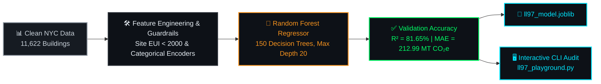

# 🤖 Artificial Intelligence & Predictive Modeling Layer

Welcome to the **Machine Learning Layer** of the **Carbon Heist Mitigation Platform**. This directory houses our predictive engine, feature encoders, training pipelines, and interactive CLI simulation playground used to forecast greenhouse gas emissions and evaluate statutory penalty exposure under **NYC Local Law 97**.

---

## 📂 Folder Contents

| File Name | Description |
| :--- | :--- |
| **`train_ll97_model.py`** | Automated Python model training pipeline (`scikit-learn`, `joblib`). Loads cleaned records, applies outlier guardrails (**Site EUI < 2000**), encodes categorical features, trains a **Random Forest Regressor**, validates accuracy (**R² = 81.65%**), and exports serialized models. |
| **`ll97_playground.py`** | Interactive command-line simulation playground. Allows engineers to input custom building specifications (Year Built, GFA, Energy Star, Borough, Property Type) and inspect predicted emissions and financial penalties in real time. |
| **`ll97_model.joblib`** | Serialized trained **Random Forest Regressor** model (`n_estimators=150`, `max_depth=20`) ready for production inference. |
| **`ll97_encoders.joblib`** | Serialized categorical feature encoders ensuring consistency across training, testing, and UI inference. |

---

## 📈 Model Architecture & Flow



### Model Performance Highlights:
- **Algorithm:** `RandomForestRegressor` (`n_estimators=150`, `max_depth=20`)
- **Predictors (Features):** `Year Built`, `Gross Floor Area (GFA)`, `ENERGY STAR Score`, `Borough`, `Primary Property Type`
- **Target Variable:** `Total GHG Emissions (Metric Tons CO2e)`
- **Validated Accuracy (R²):** **81.65%**
- **Mean Absolute Error (MAE):** **212.99 MT CO₂e**

---

## 🚀 How to Execute & Retrain

### 1. Retrain Model & Regenerate `.joblib` Artifacts:
```bash
cd models
python train_ll97_model.py
```

### 2. Run Interactive CLI Playground:
```bash
cd models
python ll97_playground.py
```

---

<div align="center">

[](https://github.com/ahmedadelamin/carbon-heist-mitigation)&nbsp;
[](../Project%20Documentations/README.md)

</div>
